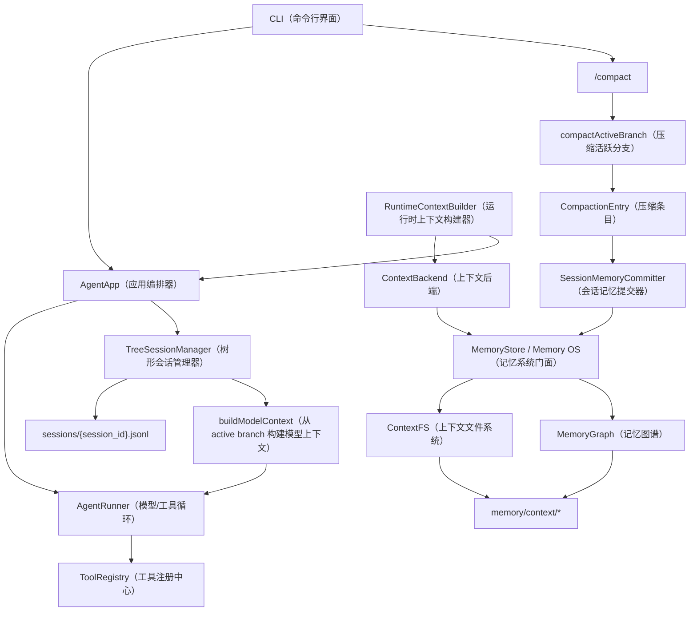

# Context/Memory + Tree Session 最新融合实施方案

> 面向 coder agent 的中文执行版。本文是新版方案，不覆盖 `2026-05-23-context-memory-fusion-plan.md` 或 `.zh.md`。

## 1. 目标与约束

### 1.1 业务目标

本项目用于 agent 架构比赛。差异化重点放在 context（上下文）和 memory（记忆）能力，不重写现有执行底座。

最终要展示的能力：

- 原始会话由 TreeSession（树形会话）完整保存，支持分支、跳转、克隆和安全压缩。
- 长期记忆由 ContextFS（上下文文件系统）持久化为可检查的 URI 对象。
- 相关记忆通过 MemoryGraph（记忆图谱）建立轻量链接，实现图谱式召回，但不引入图数据库。
- 每轮模型调用前，RuntimeContextBuilder（运行时上下文构建器）召回相关 L0/L1 记忆并注入 system prompt。
- 记忆写入有边界：手动 `remember` 可直接写入；自动长期记忆只在 TreeSession compaction（树形会话压缩）后提交。

### 1.2 关键术语

- `TreeSession（树形会话）`：当前仓库已有的 append-only JSONL 会话树。每个条目有 `id` 和 `parentId`，当前上下文由 `activeLeafId` 所在分支构建。
- `TreeSessionManager（树形会话管理器）`：负责会话树持久化、恢复、分支、压缩和模型上下文构建。
- `ContextFS（上下文文件系统）`：把长期上下文和记忆对象按 URI、metadata（元数据）、L0/L1/L2 内容层级存到本地文件系统。
- `MemoryGraph（记忆图谱）`：存储 ContextFS URI 之间的关系链接，只做派生索引，不存事实内容。
- `RuntimeContextBuilder（运行时上下文构建器）`：每轮根据用户输入搜索 ContextFS，并通过 MemoryGraph 做有限扩展，产出可注入 prompt 的上下文块。
- `ContextBackend（上下文后端）`：RuntimeContextBuilder 和 context tools 访问记忆系统的接口协议。MVP（最小可行产品）只实现本地后端。
- `Memory OS（记忆系统）`：升级后的 `MemoryStore` 门面，兼容旧 `MEMORY.md`，同时管理 ContextFS、MemoryGraph、结构化记忆和 diff 日志。
- `L0/L1/L2`：L0 是一句话摘要；L1 是可注入概览；L2 是完整正文。
- `CompactionEntry（压缩条目）`：TreeSession 压缩后追加到会话树中的摘要节点，包含 `summary`、`compactedEntryIds`、`firstKeptEntryId` 等字段。
- `firstKeptEntryId（首个保留条目 ID）`：压缩后最近原文窗口的第一个节点，用于把 compaction summary 和未压缩的近期消息拼接起来。

### 1.3 硬约束

- 保留现有 `AgentRunner（智能体运行器）`、`ToolRegistry（工具注册中心）`、模型 provider、MCP（模型上下文协议）桥接、subagents（子智能体）和 team（团队协作）机制。
- 不新增运行时依赖；使用 Python 3.11 标准库、现有 Jinja2、现有 `unittest`。
- 不实现 vector DB（向量数据库）、embedding（向量嵌入）、reranker（重排序模型）、OpenViking 默认后端、gbrain 服务或后台 daemon（常驻进程）。
- 不删除旧文件：`memory/MEMORY.md`、`memory/history.jsonl`、`memory/compactions.md`、`templates/USER.md`。
- 所有新增运行时状态放在 `memory/` 下；原始会话事实源继续放在 `sessions/*.jsonl`。

## 2. 冲突裁决

旧融合方案写于 TreeSession 成为主事实源之前，因此有几处必须调整。

| 冲突点 | 旧方案 | 最新 TreeSession 实现 | 裁决 |
|---|---|---|---|
| 原始会话事实源 | `MemoryStore.capture_turn()` 写 `memory/context/sessions/current/messages.jsonl` | `TreeSessionManager` 写 `sessions/{session_id}.jsonl`，并用 `activeLeafId` 表达当前分支 | 以 `TreeSessionManager` 为唯一 raw session source of truth，裁掉并行 current messages。 |
| 自动提交边界 | `HistoryCompactor` 负责 session commit | `/compact` 调用 `TreeSessionManager.compactActiveBranch()`，产出 `CompactionEntry` | 新版 boundary commit 绑定 `CompactionEntry`，不绑定旧线性 compactor。 |
| 压缩输入 | 线性 history slice | active branch，且支持 previous summary、tool boundary、file operation blocks | `CompactionEntry.summary` 是 memory extraction 的主证据；metadata 只做 provenance（来源证明）和校验补充。Memory extraction 只产出结构化 MemoryOperation，不做二次压缩。 |
| 旧 `memory/history.jsonl` | 可作为未归档历史输入 | 仍被 `append_history` 写入，但 README 已把 `sessions/*.jsonl` 作为会话树事实源 | `memory/history.jsonl` 只做 legacy compatibility，不作为新版 memory extraction 主输入。 |
| Session archive | 从 `sessions/current/messages.jsonl` 归档 | 从 `CompactionEntry` 和 active branch debug 信息生成 | 新增 `SessionMemoryCommitter` 消费 tree compaction。 |
| 分支语义 | 默认线性会话 | 同一 JSONL 中可有 sibling branch，当前上下文只取 active branch | 任何 context/memory 实现都必须以 `activeLeafId` 为准。 |

最终决策：

- 不实现 `memory/context/sessions/current/messages.jsonl`。
- `MemoryStore.capture_turn()` 如需保留，只能作为兼容 no-op 或写 legacy history，不能创建第二套 raw session。
- `HistoryCompactor（旧线性历史压缩器）` 保留给 legacy startup compaction；默认不参与新版自动记忆提交。
- 新版自动长期记忆写入入口是 `SessionMemoryCommitter.commit_compaction(session_id, compaction_id)`。
- ContextFS 只保存 durable context/memory objects，不保存原始会话流。

## 3. 新版整体架构



### 3.1 主数据流

```text
用户/助手/工具消息
  -> TreeSessionManager.append_*()
  -> sessions/{session_id}.jsonl
  -> active branch
  -> /compact
  -> CompactionEntry(summary, compactedEntryIds, firstKeptEntryId)
  -> SessionMemoryCommitter.commit_compaction()
  -> session archive ContextObject
  -> memory operations
  -> ContextFS memory objects
  -> MemoryGraph links
  -> RuntimeContextBuilder recall
  -> next AgentRunner.step() system prompt
```

### 3.2 每轮模型调用流程

1. `AgentApp.ask(user_input)` 先把用户消息写入 TreeSession。
2. RuntimeContextBuilder 根据 `user_input` 搜索结构化记忆。
3. `ContextBuilder.build(workspace, runtime_context)` 重新生成 system prompt。
4. `AgentRunner.step()` 使用 `tree.buildModelContext(session_id)` 获取 active branch messages。
5. runner 回调继续把 assistant message、tool_call、tool_result 写回 TreeSession。
6. 最终 assistant 文本仍写入 legacy `memory/history.jsonl`，仅用于兼容。

### 3.3 `/compact` 流程

1. CLI 调用 `AgentApp.compact_now()`。
2. `TreeSessionManager.compactActiveBranch()` 追加 `CompactionEntry`。
3. 如果返回 compaction id，调用 `SessionMemoryCommitter.commit_compaction(session_id, compaction_id)`。
4. committer 读取压缩摘要、压缩范围和 active branch debug 信息。
5. committer 创建 session archive ContextObject，并让模型或规则生成 memory operations。
6. MemoryStore 应用 operations，写 ContextFS、MemoryGraph、diffs 和 legacy outputs。

## 4. 模块职责

### 4.1 `TreeSessionManager（树形会话管理器）`

- **角色定位：** 原始会话事实源。
- **核心职责：** JSONL 持久化、active branch 构建、分支跳转、克隆、标签、Context Ladder、压缩。
- **非职责边界：** 不负责长期记忆分类、ContextFS URI 存储、Runtime Context 召回。
- **输入输出：** 输入用户/助手/工具条目；输出 active branch messages、debug 信息和 CompactionEntry。
- **对外接口：** 现有 `append_message`、`append_tool_call`、`append_tool_result`、`buildModelContext`、`debugBuildModelContext`、`compactActiveBranch`。
- **测试重点：** active branch 不混入 sibling branch；压缩后 summary + recent window 正确；tool result 不孤立。

### 4.2 `SessionMemoryCommitter（会话记忆提交器）`

- **角色定位：** TreeSession 和 Memory OS 之间的边界提交器。
- **核心职责：** 消费 CompactionEntry，创建 session archive，并触发结构化 memory operations。
- **非职责边界：** 不写原始会话流，不替代 TreeSession，不直接执行工具。
- **输入输出：** 输入 `session_id` 和 `compaction_id`；输出 session archive URI。
- **对外接口：** `commit_compaction(session_id: str, compaction_id: str) -> str`。
- **内部状态：** 不持有独立事实源，只依赖 TreeSession 和 MemoryStore。
- **失败处理：** extraction 失败仍创建 archive，并写 quarantine/diff。
- **测试重点：** 不读取 `memory/history.jsonl`；能从 CompactionEntry 生成 archive；失败不污染 active memory。

### 4.3 `ContextFS（上下文文件系统）`

- **角色定位：** durable context/memory object store（持久上下文和记忆对象存储）。
- **核心职责：** URI 校验、路径映射、L0/L1/L2 读写、metadata index、关键词检索（含 L2 全文匹配）、敏感/过期过滤、diff 日志。
- **非职责边界：** 不保存 raw session stream，不调用模型，不做图谱扩展。
- **对外接口：** `write_object`、`read_object`、`list_objects`、`search_objects`、`append_diff`。
- **搜索范围：** 所有 URI（`mem://`、`ctx://resources/`、`ctx://sessions/archives/`）。L2 正文命中 1 分，低于 title（5 分）和 abstract（3 分）。
- **内部状态：** `memory/context/index.jsonl`、`memory/context/diffs.jsonl`、对象 Markdown 文件。

### 4.4 `MemoryGraph（记忆图谱）`

- **角色定位：** ContextFS URI 之间的派生链接索引。
- **核心职责：** `add_link`、`neighbors`、`expand`、`auto_link`，按 confidence 排序并限制 fanout。`auto_link` 在新记忆写入时调用 LLM 判断与已有记忆的关系（supports/contradicts/updates/related），自动创建链接。
- **非职责边界：** 不存正文，不作为事实源，不做复杂图算法。
- **内部状态：** `memory/context/links.jsonl`。
- **失败处理：** dangling link 可记录，但读取不存在 URI 时由 ContextFS 返回明确错误。auto_link 的 LLM 调用失败时降级为关键词匹配（title/tag 重叠创建 related 链接）。

### 4.5 `MemoryStore / Memory OS（记忆系统门面）`

- **角色定位：** 兼容旧 API，同时持有 ContextFS 和 MemoryGraph。
- **核心职责：** 保留 `read_memory`、`write_memory`、`append_memory`、`append_history`；新增结构化 remember、archive commit、context read/search/list、graph neighbors、render memory。
- **非职责边界：** 不再创建并行 raw session current log。
- **关键接口：** `commit_session_archive`、`remember_note`、`search_memory`、`read_context`、`list_context`、`graph_neighbors`、`render_memory`。

### 4.6 `RuntimeContextBuilder（运行时上下文构建器）`

- **角色定位：** 每轮模型调用前的记忆召回器。
- **核心职责：** 查询 ContextBackend、扩展 MemoryGraph links、预算裁剪、渲染可解释 Runtime Context。
- **非职责边界：** 不写 memory，不改 TreeSession。
- **输出格式：** Markdown，包含 URI、trust_score、updated_at、matched reason、L1 overview。

### 4.7 `ContextBackend（上下文后端）`

- **角色定位：** RuntimeContextBuilder 和 context tools 的稳定接口。
- **MVP 实现：** `LocalContextBackend`，委托给 MemoryStore。
- **search 行为：** 搜索所有 URI（`mem://`、`ctx://resources/`、`ctx://sessions/archives/`），含 L2 正文全文匹配。
- **后续扩展：** `OpenVikingMCPBackend` 只作为未来方案，不进 MVP。

### 4.8 `Context Tools（上下文工具）`

新增工具：

- `search_context(query, limit=5)`
- `read_context(uri, layer="auto")`
- `list_context(prefix="mem://", limit=50)`
- `show_context_links(uri, limit=5)`

升级工具：

- `remember(note, category="events", title=None)`

`remember(note)` 必须保持旧调用兼容。

## 5. 数据模型与接口

### 5.1 ContextObject

```python
@dataclass
class ContextObject:
    uri: str
    context_type: str  # session|memory|resource|skill
    title: str
    abstract: str      # L0
    overview: str      # L1
    content_path: str  # L2 relative path
    source: str
    trust_score: float
    sensitivity: str   # public|internal|sensitive
    status: str        # active|quarantine|archived
    tags: list[str]
    metadata: dict[str, Any]
    digest: str
    created_at: str
    updated_at: str
    ttl: str | None = None
```

### 5.2 URI 规则

```text
ctx://sessions/archives/{yyyy}/{mm}/{dd}/{session_id}-{compaction_id}
ctx://resources/{slug}
mem://user/profile
mem://user/preferences/{slug}
mem://user/entities/{slug}
mem://user/events/{yyyy}/{mm}/{dd}/{slug}
mem://project/decisions/{slug}
mem://project/constraints/{slug}
mem://project/open_tasks/{slug}
mem://agent/cases/{slug}
mem://agent/patterns/{slug}
mem://agent/tools/{slug}
mem://agent/skills/{slug}
mem://quarantine/{slug}
```

禁止新增：

```text
ctx://sessions/current
memory/context/sessions/current/messages.jsonl
```

如需表示当前会话，使用 TreeSession 的 `session_id` 和 `activeLeafId`，不要在 ContextFS 中复制 raw stream。

### 5.3 MemoryOperation

```python
{
    "action": "upsert" | "append" | "quarantine" | "link",
    "category": "profile" | "preferences" | "entities" | "events"
        | "decisions" | "constraints" | "open_tasks"
        | "cases" | "patterns" | "tools" | "skills",
    "key": "stable-slug",
    "title": "短标题",
    "abstract": "一句话摘要",
    "overview": "可注入概览",
    "content": "完整正文",
    "reason": "为什么写入长期记忆",
    "trust_score": 0.0,
    "tags": ["optional"],
    "links": [
        {
            "target_uri": "mem://...",
            "relation": "supports|contradicts|updates|related|derived_from|uses_tool",
            "confidence": 0.0,
            "reason": "关系依据"
        }
    ]
}
```

### 5.4 `SessionMemoryCommitter.commit_compaction`

```python
class SessionMemoryCommitter:
    def __init__(self, tree: TreeSessionManager, memory_store: MemoryStore, extractor: MemoryExtractor) -> None: ...

    def commit_compaction(self, session_id: str, compaction_id: str) -> str: ...
```

行为要求：

- 校验 `compaction_id` 指向 `CompactionEntry`。
- 读取 `summary`、`compactedEntryIds`、`firstKeptEntryId`、`tokenEstimateBefore`、`tokenEstimateAfter`。
- 调用 `tree.debugBuildModelContext(session_id)` 获取 active branch/debug metadata。
- 生成 archive URI：`ctx://sessions/archives/{yyyy}/{mm}/{dd}/{session_id}-{compaction_id}`。
- 调用 `MemoryStore.commit_session_archive(session_uri, summary, operations, metadata)`。
- 返回 session archive URI。

### 5.5 `MemoryExtractor`

```python
class MemoryExtractor(Protocol):
    def extract(self, *, session_uri: str, summary: str, metadata: dict[str, Any]) -> tuple[list[dict[str, Any]], str | None]: ...
```

MVP 实现：

- `LlmMemoryExtractor（LLM 记忆抽取器）`：使用现有 model client，以 `CompactionEntry.summary` 为主证据，从中抽取 JSON memory operations。**必须真实调用 LLM**，不采用规则提取的妥协方案。
- `NoopMemoryExtractor（空抽取器）`：测试使用，返回 `([], None)`，确保 archive 写入不依赖模型抽取成功。生产代码不使用 Noop。

输入边界：

- `CompactionEntry.summary` 是抽取的主输入，因为它已经是 tree compaction 生成的结构化 checkpoint summary。
- `compactedEntryIds`、`firstKeptEntryId`、token estimates、active branch debug、`<read-files>` 和 `<modified-files>` 只作为 provenance 与校验信息。
- extractor 不能再生成“摘要的摘要”；它只能输出结构化 `MemoryOperation`，例如项目决策、用户偏好、约束、事件、agent case 或 link。

失败约定：

- 返回 `(operations, None)` 表示抽取成功。
- 返回 `([], "error_code_or_message")` 表示抽取失败；committer 仍必须写 session archive，并把失败写入 quarantine/diff。

### 5.6 `MemoryStore.commit_session_archive`

```python
def commit_session_archive(
    self,
    session_uri: str,
    summary: str,
    operations: list[dict[str, Any]],
    metadata: dict[str, Any],
) -> str: ...
```

行为要求：

- 写 session archive ContextObject，`context_type="session"`、`status="archived"`、`trust_score=0.7`。
- archive L2 正文至少包含 compaction summary、compacted ids、first kept id、token estimates、file operation blocks。
- 对合法 operations 写 memory objects。
- 对非法 operations 写 `mem://quarantine/{slug}`。
- 为每个新 memory object 添加 `derived_from -> session_uri` link。
- 每次变更写 `diffs.jsonl`。

### 5.7 `ContextBackend`

```python
class ContextBackend(Protocol):
    def search(self, query: str, limit: int = 6) -> list[dict[str, Any]]: ...
    def read(self, uri: str, layer: str = "auto") -> str: ...
    def list(self, prefix: str = "mem://", limit: int = 50) -> list[dict[str, Any]]: ...
    def remember(self, note: str, category: str = "events", title: str | None = None) -> str: ...
    def neighbors(self, uri: str, limit: int = 5) -> list[dict[str, Any]]: ...
```

### 5.8 `RuntimeContextBuilder.build`

```python
def build(self, query: str) -> str: ...
```

行为要求：

- 搜索所有 URI（`mem://`、`ctx://resources/`、`ctx://sessions/archives/`），含 L2 正文全文匹配。
- 搜索 top N objects（默认 6）。
- 对 top results 做有限 link expansion（fanout 默认 3）。
- 默认排除 `sensitivity="sensitive"`、`status="quarantine"`、过期 TTL。
- 按字符预算裁剪（默认 12000 字符）。
- 输出 `## Runtime Context` Markdown。
- 每条包含 `URI`、`Trust`、`Updated`、`Matched`、`Summary`。
- 空结果返回 `(No runtime context recalled.)`。

### 5.9 环境变量

| 变量 | 默认值 | 说明 | 读取位置 |
|---|---|---|---|
| `MY_AGENT_RUNTIME_CONTEXT_LIMIT` | `6` | RuntimeContext 搜索返回条数上限 | `loop.py` `AgentApp.__init__` |
| `MY_AGENT_RUNTIME_CONTEXT_MAX_CHARS` | `12000` | RuntimeContext 输出字符预算 | `loop.py` `AgentApp.__init__` |
| `MY_AGENT_CONTEXT_BACKEND` | `local` | 上下文后端选择（MVP 仅 `local`） | `loop.py` `AgentApp.__init__` |
| `MY_AGENT_AUTO_LINK_FANOUT` | `5` | auto_link 候选记忆数 | `memory_graph.py` |
| `MY_AGENT_AUTO_LINK_MIN_CONFIDENCE` | `0.3` | auto_link 最低置信度 | `memory_graph.py` |

## 6. 实施任务

> **依赖关系：** Task 0 → Task 1 + Task 2 → Task 3 → Task 4 → Task 5 → Task 6 → Task 7 → Task 8 → Task 9 → Task 10
> Task 1 与 Task 2 可并行；Task 8 可与 Task 6/7 并行。

---

### Task 0：测试基础设施

**文件：**
- 创建: `tests/helpers.py`

- [ ] **Step 1: 创建 tests/helpers.py**

```python
"""Shared test helpers for context/memory tests."""
from __future__ import annotations

import json
import tempfile
from pathlib import Path
from typing import Any


def make_temp_dir() -> Path:
    """Create a temporary directory that lives for the test duration."""
    return Path(tempfile.mkdtemp())


def make_contextfs_root(tmp: Path) -> Path:
    """Create a memory/context directory structure."""
    root = tmp / "memory" / "context"
    root.mkdir(parents=True)
    (root / "index.jsonl").touch()
    (root / "diffs.jsonl").touch()
    (root / "links.jsonl").touch()
    return root


def make_memory_object(
    uri: str,
    *,
    title: str = "Test Memory",
    abstract: str = "Test abstract.",
    overview: str = "Test overview.",
    content: str = "Full test content.",
    context_type: str = "memory",
    trust_score: float = 0.8,
    tags: list[str] | None = None,
) -> dict[str, Any]:
    return {
        "uri": uri,
        "context_type": context_type,
        "title": title,
        "abstract": abstract,
        "overview": overview,
        "source": "test",
        "trust_score": trust_score,
        "sensitivity": "public",
        "status": "active",
        "tags": tags or [],
        "metadata": {},
        "digest": "fake-digest",
        "created_at": "2026-05-24T10:00:00+08:00",
        "updated_at": "2026-05-24T10:00:00+08:00",
        "ttl": None,
        "content_path": "",
    }


def make_fake_model_client(responses: list[Any] | None = None):
    """Return a fake model client that returns predetermined responses.
    
    Each response is a list of content blocks. Call .create_message() pops
    the first response from the list.
    """
    class FakeUsage:
        input_tokens = 100
        output_tokens = 50

    class FakeResponse:
        def __init__(self, content):
            self.content = content
            self.usage = FakeUsage()
            self.stop_reason = "stop"

    class FakeClient:
        def __init__(self, resps):
            self.resps = list(resps or [])
            self.requests = []

        def create_message(self, **kwargs):
            self.requests.append(kwargs)
            if not self.resps:
                raise RuntimeError("No more fake responses")
            return FakeResponse(self.resps.pop(0))

    return FakeClient(list(responses or []))
```

- [ ] **Step 2: 运行测试验证 helpers 可导入**

```powershell
$env:PYTHONPATH="src;tests"; python -c "from helpers import make_temp_dir, make_contextfs_root, make_memory_object, make_fake_model_client; print('OK')"
```

预期输出: `OK`

- [ ] **Step 3: 提交**

```powershell
git add tests/helpers.py
git commit -m "feat: add test helpers for context/memory tests"
```

---

### Task 1：补齐 ContextFS

**文件：**
- 创建: `src/my_agent2/contextfs.py`
- 创建: `tests/test_contextfs.py`

- [ ] **Step 1: 写 ContextObject dataclass 测试**

`tests/test_contextfs.py`:

```python
from __future__ import annotations

import unittest
from pathlib import Path
from helpers import make_temp_dir, make_contextfs_root

from my_agent2.contextfs import ContextFS, ContextObject


class ContextFSBasicTests(unittest.TestCase):
    def setUp(self):
        self.tmp = make_temp_dir()
        self.root = make_contextfs_root(self.tmp)
        self.cfs = ContextFS(self.root.parent.parent)  # memory_dir

    def test_write_and_read_object_auto_returns_l1(self):
        obj = ContextObject(
            uri="mem://test/item",
            context_type="memory",
            title="Test Item",
            abstract="One line abstract.",
            overview="Multi-line overview content.",
            content_path="mem/test/item.md",
            source="test",
            trust_score=0.8,
            sensitivity="public",
            status="active",
            tags=["test"],
            metadata={},
            digest="abc123",
            created_at="2026-01-01T00:00:00Z",
            updated_at="2026-01-01T00:00:00Z",
        )
        self.cfs.write_object(obj, "Full L2 body text.")
        result = self.cfs.read_object("mem://test/item", layer="auto")
        self.assertEqual(result["uri"], "mem://test/item")
        self.assertIn("Multi-line overview", result["content"])

    def test_read_object_full_returns_l2(self):
        obj = ContextObject(
            uri="mem://test/full",
            context_type="memory",
            title="Full Test",
            abstract="Abstract.",
            overview="Overview.",
            content_path="mem/test/full.md",
            source="test",
            trust_score=0.7,
            sensitivity="public",
            status="active",
            tags=[],
            metadata={},
            digest="def456",
            created_at="2026-01-01T00:00:00Z",
            updated_at="2026-01-01T00:00:00Z",
        )
        self.cfs.write_object(obj, "Complete L2 content here.")
        result = self.cfs.read_object("mem://test/full", layer="full")
        self.assertIn("Complete L2 content", result["content"])
```

- [ ] **Step 2: 运行测试确认失败**

```powershell
$env:PYTHONPATH="src;tests"; python -m pytest tests/test_contextfs.py -v 2>$null
if ($LASTEXITCODE -ne 0) { Write-Host "FAIL (expected)" }
```

预期: `ModuleNotFoundError: No module named 'my_agent2.contextfs'`

- [ ] **Step 3: 实现 ContextFS 最小版本（写 + 读）**

`src/my_agent2/contextfs.py`:

```python
from __future__ import annotations

import hashlib
import json
import os
import re
from dataclasses import asdict, dataclass, field
from datetime import datetime, timezone
from pathlib import Path
from typing import Any


@dataclass
class ContextObject:
    uri: str
    context_type: str  # session|memory|resource|skill
    title: str
    abstract: str      # L0
    overview: str      # L1
    content_path: str  # L2 relative path from context root
    source: str
    trust_score: float
    sensitivity: str   # public|internal|sensitive
    status: str        # active|quarantine|archived
    tags: list[str] = field(default_factory=list)
    metadata: dict[str, Any] = field(default_factory=dict)
    digest: str = ""
    created_at: str = ""
    updated_at: str = ""
    ttl: str | None = None


def _compute_digest(content: str) -> str:
    return hashlib.sha256(content.encode("utf-8")).hexdigest()[:16]


def _uri_to_path(uri: str) -> str:
    """mem://user/profile -> mem/user/profile"""
    return re.sub(r"^(\w+)://", r"\1/", uri)


def _now_iso() -> str:
    return datetime.now(timezone.utc).isoformat(timespec="seconds")


class ContextFS:
    def __init__(self, memory_dir: Path) -> None:
        self.memory_dir = Path(memory_dir)
        self.root = self.memory_dir / "context"
        self.root.mkdir(parents=True, exist_ok=True)
        self.index_path = self.root / "index.jsonl"
        self.diffs_path = self.root / "diffs.jsonl"
        if not self.index_path.exists():
            self.index_path.write_text("", encoding="utf-8")
        if not self.diffs_path.exists():
            self.diffs_path.write_text("", encoding="utf-8")

    # ---- write ----

    def write_object(self, obj: ContextObject, content: str) -> str:
        now = _now_iso()
        if not obj.created_at:
            obj.created_at = now
        obj.updated_at = now
        obj.digest = _compute_digest(content)
        if not obj.content_path:
            obj.content_path = _uri_to_path(obj.uri) + ".md"

        # write L2
        l2_path = self.root / obj.content_path
        l2_path.parent.mkdir(parents=True, exist_ok=True)
        l2_path.write_text(content, encoding="utf-8")

        # upsert index
        self._upsert_index(obj)
        return obj.uri

    def _upsert_index(self, obj: ContextObject) -> None:
        lines = self._read_index_lines()
        data = asdict(obj)
        found = False
        for i, line in enumerate(lines):
            if not line.strip():
                continue
            entry = json.loads(line)
            if entry.get("uri") == obj.uri:
                lines[i] = json.dumps(data, ensure_ascii=False)
                found = True
                break
        if not found:
            lines.append(json.dumps(data, ensure_ascii=False))
        self.index_path.write_text("\n".join(lines) + "\n", encoding="utf-8")

    # ---- read ----

    def read_object(self, uri: str, layer: str = "auto") -> dict[str, Any]:
        entry = self._find_index_entry(uri)
        if entry is None:
            raise KeyError(f"URI not found: {uri}")
        if layer == "auto":
            content = entry.get("overview", "") or entry.get("abstract", "")
        elif layer == "full":
            l2_path = self.root / entry.get("content_path", "")
            content = l2_path.read_text(encoding="utf-8") if l2_path.exists() else ""
        else:
            content = entry.get(layer, "")
        return {"uri": uri, "content": content, **entry}

    # ---- list ----

    def list_objects(self, prefix: str = "", limit: int = 50) -> list[dict[str, Any]]:
        results = []
        for line in self._read_index_lines():
            if not line.strip():
                continue
            entry = json.loads(line)
            if prefix and not entry.get("uri", "").startswith(prefix):
                continue
            results.append(entry)
            if len(results) >= limit:
                break
        return results

    # ---- search ----

    def search_objects(self, query: str, limit: int = 5, *, include_sensitive: bool = False) -> list[dict[str, Any]]:
        tokens = query.lower().split()
        scored = []
        for line in self._read_index_lines():
            if not line.strip():
                continue
            entry = json.loads(line)
            if not include_sensitive:
                if entry.get("sensitivity") == "sensitive":
                    continue
                if entry.get("status") == "quarantine":
                    continue
                ttl = entry.get("ttl")
                if ttl and _is_expired(ttl):
                    continue

            score = 0.0
            title = (entry.get("title") or "").lower()
            abstract = (entry.get("abstract") or "").lower()
            overview = (entry.get("overview") or "").lower()
            uri = (entry.get("uri") or "").lower()
            tags = " ".join(entry.get("tags") or []).lower()

            for token in tokens:
                if token in title:
                    score += 5
                elif token in tags:
                    score += 4
                elif token in abstract:
                    score += 3
                elif token in overview:
                    score += 2
                elif token in uri:
                    score += 1

            # L2 full-text search
            l2_path = self.root / (entry.get("content_path") or "")
            if l2_path.exists():
                l2_text = l2_path.read_text(encoding="utf-8").lower()
                for token in tokens:
                    if token in l2_text:
                        score += 1

            if score > 0:
                scored.append((score, entry))

        scored.sort(key=lambda x: (-x[0], -(x[1].get("trust_score") or 0)))
        return [entry for _, entry in scored[:limit]]

    # ---- diff ----

    def append_diff(self, entry: dict[str, Any]) -> None:
        entry.setdefault("ts", _now_iso())
        with self.diffs_path.open("a", encoding="utf-8") as f:
            f.write(json.dumps(entry, ensure_ascii=False) + "\n")

    # ---- internals ----

    def _read_index_lines(self) -> list[str]:
        if not self.index_path.exists():
            return []
        text = self.index_path.read_text(encoding="utf-8")
        return text.splitlines()

    def _find_index_entry(self, uri: str) -> dict[str, Any] | None:
        for line in self._read_index_lines():
            if not line.strip():
                continue
            entry = json.loads(line)
            if entry.get("uri") == uri:
                return entry
        return None


def _is_expired(ttl: str) -> bool:
    try:
        expiry = datetime.fromisoformat(ttl)
        return datetime.now(timezone.utc) > expiry
    except ValueError:
        return False
```

- [ ] **Step 4: 运行测试确认通过**

```powershell
$env:PYTHONPATH="src;tests"; python -m pytest tests/test_contextfs.py -v 2>$null
```

预期: 2 passed

- [ ] **Step 5: 补充搜索和过滤测试**

`tests/test_contextfs.py` 追加到 class:

```python
    def test_search_finds_by_title_tag_and_l2(self):
        self.cfs.write_object(ContextObject(
            uri="mem://alpha/one", context_type="memory", title="Alpha Brava",
            abstract="abstract.", overview="overview.", content_path="mem/alpha/one.md",
            source="test", trust_score=0.8, sensitivity="public", status="active",
            tags=["important"], metadata={}, digest="x", created_at="", updated_at="",
        ), "This L2 content has the keyword 'squirrel' buried in it.")
        self.cfs.write_object(ContextObject(
            uri="mem://beta/two", context_type="memory", title="Beta Charlie",
            abstract="abstract beta.", overview="overview.", content_path="mem/beta/two.md",
            source="test", trust_score=0.6, sensitivity="public", status="active",
            tags=[], metadata={}, digest="x", created_at="", updated_at="",
        ), "Generic content.")

        results = self.cfs.search_objects("squirrel", limit=5)
        self.assertEqual(len(results), 1)
        self.assertEqual(results[0]["uri"], "mem://alpha/one")

        results2 = self.cfs.search_objects("beta", limit=5)
        self.assertEqual(len(results2), 1)
        self.assertEqual(results2[0]["uri"], "mem://beta/two")

    def test_search_skips_sensitive_and_quarantine(self):
        self.cfs.write_object(ContextObject(
            uri="mem://secret/x", context_type="memory", title="Secret",
            abstract="secret abstract.", overview="overview.", content_path="mem/secret/x.md",
            source="test", trust_score=0.5, sensitivity="sensitive", status="active",
            tags=[], metadata={}, digest="x", created_at="", updated_at="",
        ), "sensitive content")
        self.cfs.write_object(ContextObject(
            uri="mem://bad/y", context_type="memory", title="Bad",
            abstract="bad abstract.", overview="overview.", content_path="mem/bad/y.md",
            source="test", trust_score=0.5, sensitivity="public", status="quarantine",
            tags=[], metadata={}, digest="x", created_at="", updated_at="",
        ), "quarantine content")

        results = self.cfs.search_objects("secret", limit=5)
        self.assertEqual(len(results), 0)

        results2 = self.cfs.search_objects("bad", limit=5)
        self.assertEqual(len(results2), 0)

    def test_list_objects_by_prefix(self):
        self.cfs.write_object(ContextObject(
            uri="mem://user/prefs/theme", context_type="memory", title="Theme",
            abstract="dark mode.", overview="User prefers dark mode.", content_path="mem/user/prefs/theme.md",
            source="test", trust_score=0.9, sensitivity="public", status="active",
            tags=["preference"], metadata={}, digest="x", created_at="", updated_at="",
        ), "User always uses dark mode theme.")
        self.cfs.write_object(ContextObject(
            uri="mem://agent/cases/bug1", context_type="memory", title="Bug 1",
            abstract="null pointer.", overview="NPE in auth.", content_path="mem/agent/cases/bug1.md",
            source="test", trust_score=0.7, sensitivity="public", status="active",
            tags=["case"], metadata={}, digest="x", created_at="", updated_at="",
        ), "Fixed NPE in AuthService.login().")

        prefs = self.cfs.list_objects(prefix="mem://user/", limit=10)
        self.assertEqual(len(prefs), 1)
        self.assertEqual(prefs[0]["uri"], "mem://user/prefs/theme")

        all_objs = self.cfs.list_objects(limit=50)
        self.assertGreaterEqual(len(all_objs), 2)
```

- [ ] **Step 6: 运行全部 ContextFS 测试**

```powershell
$env:PYTHONPATH="src;tests"; python -m pytest tests/test_contextfs.py -v 2>$null
```

预期: 5 passed

- [ ] **Step 7: 提交**

```powershell
git add src/my_agent2/contextfs.py tests/test_contextfs.py
git commit -m "feat: add ContextFS for durable context/memory object storage"
```

---

### Task 2：补齐 MemoryGraph

**文件：**
- 创建: `src/my_agent2/memory_graph.py`
- 创建: `tests/test_memory_graph.py`

- [ ] **Step 1: 写 MemoryGraph 基础测试**

`tests/test_memory_graph.py`:

```python
from __future__ import annotations

import unittest
from pathlib import Path
from helpers import make_temp_dir

from my_agent2.memory_graph import MemoryGraph


class MemoryGraphTests(unittest.TestCase):
    def setUp(self):
        self.tmp = make_temp_dir()
        self.links_path = self.tmp / "links.jsonl"
        self.graph = MemoryGraph(self.links_path)

    def test_add_and_get_neighbors(self):
        self.graph.add_link("mem://a", "mem://b", "related", 0.8, "similar tags")
        self.graph.add_link("mem://a", "mem://c", "supports", 0.9, "confirms finding")
        neighbors = self.graph.neighbors("mem://a", limit=5)
        self.assertEqual(len(neighbors), 2)
        self.assertEqual(neighbors[0]["target_uri"], "mem://c")  # higher confidence first

    def test_duplicate_link_keeps_higher_confidence(self):
        self.graph.add_link("mem://a", "mem://b", "related", 0.5, "low")
        self.graph.add_link("mem://a", "mem://b", "related", 0.9, "high")
        neighbors = self.graph.neighbors("mem://a", limit=5)
        self.assertEqual(len(neighbors), 1)
        self.assertEqual(neighbors[0]["confidence"], 0.9)

    def test_expand_respects_fanout(self):
        self.graph.add_link("mem://a", "mem://b", "related", 0.9, "")
        self.graph.add_link("mem://b", "mem://c", "supports", 0.8, "")
        self.graph.add_link("mem://b", "mem://d", "related", 0.7, "")
        expanded = self.graph.expand(["mem://a"], fanout=2)
        self.assertLessEqual(len(expanded), 2)

    def test_neighbors_unknown_uri_returns_empty(self):
        result = self.graph.neighbors("mem://nonexistent", limit=5)
        self.assertEqual(result, [])
```

- [ ] **Step 2: 运行测试确认失败**

```powershell
$env:PYTHONPATH="src;tests"; python -m pytest tests/test_memory_graph.py -v 2>$null
if ($LASTEXITCODE -ne 0) { Write-Host "FAIL (expected)" }
```

- [ ] **Step 3: 实现 MemoryGraph**

`src/my_agent2/memory_graph.py`:

```python
from __future__ import annotations

import json
from pathlib import Path
from typing import Any


VALID_RELATIONS = {"supports", "contradicts", "updates", "related", "derived_from", "uses_tool"}


class MemoryGraph:
    def __init__(self, links_path: Path) -> None:
        self.links_path = Path(links_path)
        if not self.links_path.exists():
            self.links_path.write_text("", encoding="utf-8")

    def add_link(self, source: str, target: str, relation: str, confidence: float, reason: str) -> None:
        if relation not in VALID_RELATIONS:
            raise ValueError(f"Invalid relation: {relation}")
        links = self._read_links()
        # deduplicate: same source+target+relation -> keep higher confidence
        for link in links:
            if link["source_uri"] == source and link["target_uri"] == target and link["relation"] == relation:
                if confidence > link["confidence"]:
                    link["confidence"] = confidence
                    link["reason"] = reason
                self._write_links(links)
                return
        links.append({
            "source_uri": source,
            "target_uri": target,
            "relation": relation,
            "confidence": confidence,
            "reason": reason,
        })
        self._write_links(links)

    def neighbors(self, uri: str, limit: int = 5) -> list[dict[str, Any]]:
        links = self._read_links()
        result = [link for link in links if link["source_uri"] == uri]
        result.sort(key=lambda x: -x["confidence"])
        return result[:limit]

    def expand(self, uris: list[str], fanout: int = 3) -> list[dict[str, Any]]:
        all_links: list[dict[str, Any]] = []
        seen: set[tuple[str, str, str]] = set()
        for uri in uris:
            for link in self.neighbors(uri, limit=fanout):
                key = (link["source_uri"], link["target_uri"], link["relation"])
                if key not in seen:
                    seen.add(key)
                    all_links.append(link)
        all_links.sort(key=lambda x: -x["confidence"])
        return all_links

    def _read_links(self) -> list[dict[str, Any]]:
        if not self.links_path.exists():
            return []
        text = self.links_path.read_text(encoding="utf-8")
        return [json.loads(line) for line in text.splitlines() if line.strip()]

    def _write_links(self, links: list[dict[str, Any]]) -> None:
        self.links_path.write_text(
            "\n".join(json.dumps(link, ensure_ascii=False) for link in links) + "\n",
            encoding="utf-8",
        )
```

- [ ] **Step 4: 运行测试确认通过**

```powershell
$env:PYTHONPATH="src;tests"; python -m pytest tests/test_memory_graph.py -v 2>$null
```

预期: 4 passed

- [ ] **Step 5: 实现 auto_link 方法并补测试**

`tests/test_memory_graph.py` 追加:

```python
    def test_auto_link_creates_related_links_by_keyword_fallback(self):
        """auto_link with LLM failure falls back to keyword match."""
        from my_agent2.contextfs import ContextFS, ContextObject
        from helpers import make_contextfs_root

        root = make_contextfs_root(self.tmp)
        cfs = ContextFS(self.tmp / "memory")

        # write existing memories
        cfs.write_object(ContextObject(
            uri="mem://user/prefs/theme", context_type="memory", title="Theme Preference",
            abstract="dark mode preferred.", overview="User prefers dark mode.",
            content_path="mem/user/prefs/theme.md", source="manual", trust_score=0.9,
            sensitivity="public", status="active", tags=["preference", "theme"],
            metadata={}, digest="x", created_at="", updated_at="",
        ), "User always uses dark mode.")
        cfs.write_object(ContextObject(
            uri="mem://agent/cases/crash", context_type="memory", title="Crash Bug",
            abstract="null pointer crash.", overview="App crashes on startup.",
            content_path="mem/agent/cases/crash.md", source="compaction", trust_score=0.7,
            sensitivity="public", status="active", tags=["bug", "crash"],
            metadata={}, digest="x", created_at="", updated_at="",
        ), "NPE in main.py line 42.")

        # auto_link with keyword fallback (no LLM client)
        links = self.graph.auto_link(
            "mem://user/prefs/theme", cfs,
            client=None, model="test",
        )
        # Should link to crash? No, different topics. But could create no links.
        # Actually keyword overlap is low, so may get 0 links.
        self.assertIsInstance(links, list)
```

`src/my_agent2/memory_graph.py` 追加方法到 MemoryGraph class:

```python
    def auto_link(
        self,
        uri: str,
        contextfs: Any,
        client: Any = None,
        model: str = "",
        *,
        fanout: int = 5,
        min_confidence: float = 0.3,
    ) -> list[dict[str, Any]]:
        """Auto-link a memory to existing related memories.
        
        Uses LLM if client is provided; falls back to keyword matching.
        """
        # Find candidate memories by searching with the new memory's title/tags
        try:
            obj = contextfs.read_object(uri, layer="auto")
        except KeyError:
            return []

        candidates = contextfs.search_objects(
            obj.get("title", ""), limit=fanout, include_sensitive=False
        )
        # Remove self
        candidates = [c for c in candidates if c.get("uri") != uri]

        if client is not None and model:
            return self._llm_auto_link(uri, obj, candidates, client, model, min_confidence)
        return self._keyword_auto_link(uri, obj, candidates)

    def _keyword_auto_link(
        self, uri: str, obj: dict[str, Any], candidates: list[dict[str, Any]]
    ) -> list[dict[str, Any]]:
        created: list[dict[str, Any]] = []
        my_tags = set(obj.get("tags") or [])
        my_title = (obj.get("title") or "").lower().split()
        for cand in candidates:
            cand_uri = cand.get("uri", "")
            cand_tags = set((cand.get("tags") or []))
            cand_title = (cand.get("title") or "").lower().split()
            tag_overlap = my_tags & cand_tags
            title_overlap = set(my_title) & set(cand_title)
            if tag_overlap or len(title_overlap) >= 2:
                confidence = 0.3 + 0.1 * len(tag_overlap)
                self.add_link(uri, cand_uri, "related", min(confidence, 0.6),
                              f"keyword overlap: tags={tag_overlap}, title={title_overlap}")
                created.append({
                    "source_uri": uri, "target_uri": cand_uri,
                    "relation": "related", "confidence": min(confidence, 0.6),
                })
        return created

    def _llm_auto_link(
        self, uri: str, obj: dict[str, Any], candidates: list[dict[str, Any]],
        client: Any, model: str, min_confidence: float,
    ) -> list[dict[str, Any]]:
        if not candidates:
            return []
        prompt = _auto_link_prompt(obj, candidates)
        try:
            response = client.create_message(
                model=model, max_tokens=600, system="",
                messages=[{"role": "user", "content": prompt}], tools=[],
            )
            text = "\n".join(
                getattr(block, "text", "")
                for block in (response.content if hasattr(response, "content") else [])
            )
            operations = _parse_auto_link_json(text)
        except Exception:
            return self._keyword_auto_link(uri, obj, candidates)

        created: list[dict[str, Any]] = []
        for op in operations:
            rel = op.get("relation", "related")
            conf = float(op.get("confidence", 0.5))
            if rel in VALID_RELATIONS and conf >= min_confidence:
                self.add_link(uri, op["target_uri"], rel, conf, op.get("reason", ""))
                created.append({
                    "source_uri": uri, "target_uri": op["target_uri"],
                    "relation": rel, "confidence": conf,
                })
        return created


def _auto_link_prompt(obj: dict[str, Any], candidates: list[dict[str, Any]]) -> str:
    cand_text = "\n".join(
        f"- URI: {c.get('uri')}\\n  Title: {c.get('title')}\\n  Abstract: {c.get('abstract')}"
        for c in candidates
    )
    return f"""Analyze this new memory against existing ones and output relationship links.

New memory:
- URI: {obj.get('uri')}
- Title: {obj.get('title')}
- Abstract: {obj.get('abstract')}
- Tags: {obj.get('tags')}

Existing memories:
{cand_text}

Output JSON array of links (empty array if no relationships found):
[{{"target_uri": "...", "relation": "supports|contradicts|updates|related", "confidence": 0.0-1.0, "reason": "..."}}]"""


def _parse_auto_link_json(text: str) -> list[dict[str, Any]]:
    text = text.strip()
    if "[" in text and "]" in text:
        start = text.index("[")
        end = text.rindex("]") + 1
        text = text[start:end]
    return json.loads(text)
```

- [ ] **Step 6: 运行全部 MemoryGraph 测试**

```powershell
$env:PYTHONPATH="src;tests"; python -m pytest tests/test_memory_graph.py -v 2>$null
```

预期: 5 passed

- [ ] **Step 7: 提交**

```powershell
git add src/my_agent2/memory_graph.py tests/test_memory_graph.py
git commit -m "feat: add MemoryGraph with auto_link for URI relationship indexing"
```

---

### Task 3：升级 MemoryStore 为 Memory OS

**文件：**
- 修改: `src/my_agent2/memory.py`
- 创建: `tests/test_memory_os.py`

- [ ] **Step 1: 写 Memory OS 兼容性测试**

`tests/test_memory_os.py`:

```python
from __future__ import annotations

import unittest
from pathlib import Path
from helpers import make_temp_dir

from my_agent2.memory import MemoryStore


class MemoryOSLegacyTests(unittest.TestCase):
    def setUp(self):
        self.tmp = make_temp_dir()
        self.mem_dir = self.tmp / "memory"
        self.store = MemoryStore(self.mem_dir)

    def test_read_write_append_memory_still_works(self):
        self.store.write_memory("# Test\n- item 1")
        content = self.store.read_memory()
        self.assertIn("item 1", content)
        self.store.append_memory("item 2")
        content2 = self.store.read_memory()
        self.assertIn("item 2", content2)

    def test_append_history_and_load_unarchived(self):
        self.store.append_history("user", "hello")
        self.store.append_history("assistant", "hi there")
        unarchived = self.store.load_unarchived_history()
        self.assertEqual(len(unarchived), 2)
        self.assertEqual(unarchived[0]["role"], "user")
        self.assertEqual(unarchived[1]["role"], "assistant")

    def test_read_write_user(self):
        self.store.write_user("Name: Test User")
        self.assertEqual(self.store.read_user(), "Name: Test User")

    def test_append_compaction(self):
        self.store.append_compaction(stamp="2026-01-01T00:00:00Z", summary="Test compaction.", old_count=10)
        compactions = (self.mem_dir / "compactions.md").read_text()
        self.assertIn("Test compaction", compactions)


class MemoryOSNewAPITests(unittest.TestCase):
    def setUp(self):
        self.tmp = make_temp_dir()
        self.mem_dir = self.tmp / "memory"
        self.store = MemoryStore(self.mem_dir)

    def test_remember_note_creates_structured_memory_object(self):
        uri = self.store.remember_note("User prefers tabs over spaces", category="preferences", title="Tab Preference")
        self.assertTrue(uri.startswith("mem://"), f"Expected mem:// URI, got {uri}")
        result = self.store.read_context(uri, layer="auto")
        self.assertIn("tabs over spaces", result)

    def test_remember_note_also_writes_legacy_memory(self):
        self.store.remember_note("Important project fact", category="events")
        legacy = (self.mem_dir / "MEMORY.md").read_text(encoding="utf-8")
        self.assertIn("Important project fact", legacy)

    def test_commit_session_archive_writes_archive_and_memory_objects(self):
        ops = [{
            "action": "upsert", "category": "decisions",
            "key": "use-sqlite", "title": "Use SQLite",
            "abstract": "Decided to use SQLite for storage.",
            "overview": "Team decided to use SQLite for local storage needs.",
            "content": "Full decision record: use SQLite as embedded DB.",
            "reason": "Architecture decision captured from session.",
            "trust_score": 0.8, "tags": ["architecture"],
            "links": [],
        }]
        archive_uri = self.store.commit_session_archive(
            session_uri="ctx://sessions/archives/2026/05/24/s1-c1",
            summary="Compaction summary text.",
            operations=ops,
            metadata={"session_id": "s1", "compaction_id": "c1"},
        )
        self.assertIn("ctx://sessions/archives", archive_uri)

        # Check the memory object was written
        mem_results = self.store.search_memory("SQLite", limit=5)
        self.assertEqual(len(mem_results), 1)
        self.assertEqual(mem_results[0]["title"], "Use SQLite")

    def test_invalid_operation_goes_to_quarantine(self):
        ops = [{"action": "invalid_action", "category": "events", "key": "bad"}]
        self.store.commit_session_archive(
            session_uri="ctx://sessions/archives/2026/05/24/s2-c1",
            summary="Test.",
            operations=ops,
            metadata={},
        )
        # quarantine should have an entry
        results = self.store.list_context(prefix="mem://quarantine/", limit=10)
        self.assertGreaterEqual(len(results), 1)

    def test_no_current_messages_jsonl_created(self):
        current = self.mem_dir / "context" / "sessions" / "current"
        self.assertFalse(current.exists(), "sessions/current/messages.jsonl must not exist")
```

- [ ] **Step 2: 运行测试确认失败**

```powershell
$env:PYTHONPATH="src;tests"; python -m pytest tests/test_memory_os.py -v 2>$null
if ($LASTEXITCODE -ne 0) { Write-Host "FAIL (expected)" }
```

- [ ] **Step 3: 改造 MemoryStore**

修改 `src/my_agent2/memory.py`——在现有 `MemoryStore` 类中保留所有旧方法，新增以下方法和 `__init__` 扩展：

```python
# 在现有 import 后添加:
from .contextfs import ContextFS, ContextObject
from .memory_graph import MemoryGraph

# 修改 __init__，在现有逻辑末尾添加:
    def __init__(self, memory_dir: Path, user_file: Path | None = None) -> None:
        # ... 现有初始化代码保持不变 ...
        # 新增:
        self._cfs = ContextFS(self.memory_dir)
        self._graph = MemoryGraph(self.memory_dir / "context" / "links.jsonl")
        self._auto_link_client = None  # set externally by AgentApp
        self._auto_link_model = ""

    def set_auto_link_client(self, client: Any, model: str) -> None:
        """Set the LLM client for MemoryGraph auto_link. Called by AgentApp."""
        self._auto_link_client = client
        self._auto_link_model = model

    # ---- 新增 API ----

    def remember_note(self, note: str, category: str = "events", title: str | None = None) -> str:
        note = note.strip()
        if not note:
            return ""
        title = title or (note[:60] + "..." if len(note) > 60 else note)
        slug = _slugify(title)
        now = datetime.now(UTC8).strftime("%Y/%m/%d")
        uri = f"mem://user/{category}/{now}/{slug}"
        obj = ContextObject(
            uri=uri, context_type="memory", title=title,
            abstract=note[:200], overview=note,
            content_path=f"mem/user/{category}/{now}/{slug}.md",
            source="manual", trust_score=0.8, sensitivity="public",
            status="active", tags=[category],
            metadata={"written_by": "remember_tool"}, digest="",
            created_at=datetime.now(UTC8).isoformat(), updated_at="",
        )
        self._cfs.write_object(obj, note)
        self._cfs.append_diff({"action": "remember", "uri": uri, "reason": "manual remember"})
        # auto_link
        if self._auto_link_client:
            self._graph.auto_link(uri, self._cfs, self._auto_link_client, self._auto_link_model)
        # 兼容: 同时写 legacy MEMORY.md
        self.append_memory(f"[{category}] {note}")
        return uri

    def commit_session_archive(
        self, session_uri: str, summary: str, operations: list[dict[str, Any]], metadata: dict[str, Any]
    ) -> str:
        now = datetime.now(UTC8)
        date_part = now.strftime("%Y/%m/%d")
        slug = session_uri.split("/")[-1]

        # 写 session archive
        archive_obj = ContextObject(
            uri=session_uri, context_type="session", title=f"Session Archive {slug}",
            abstract=summary[:200], overview=summary,
            content_path=f"sessions/archives/{date_part}/{slug}.md",
            source="compaction", trust_score=0.7, sensitivity="internal",
            status="archived", tags=["session-archive"],
            metadata=metadata, digest="",
            created_at=now.isoformat(), updated_at="",
        )
        archive_content = _build_archive_content(summary, metadata)
        self._cfs.write_object(archive_obj, archive_content)

        # 处理 operations
        valid_categories = {"profile", "preferences", "entities", "events",
                            "decisions", "constraints", "open_tasks",
                            "cases", "patterns", "tools", "skills"}
        for op in operations:
            action = op.get("action", "")
            category = op.get("category", "")
            key = op.get("key", "")
            if action not in ("upsert", "append", "quarantine"):
                _write_quarantine(self._cfs, op, f"Invalid action: {action}")
                self._cfs.append_diff({"action": "quarantine", "reason": f"invalid action: {action}", "operation": op})
                continue
            if category not in valid_categories:
                _write_quarantine(self._cfs, op, f"Invalid category: {category}")
                self._cfs.append_diff({"action": "quarantine", "reason": f"invalid category: {category}", "operation": op})
                continue

            if action == "quarantine":
                _write_quarantine(self._cfs, op, op.get("reason", "manual quarantine"))
                continue

            uri = _operation_to_uri(category, key, now)
            mem_obj = ContextObject(
                uri=uri, context_type="memory",
                title=op.get("title", key),
                abstract=op.get("abstract", ""),
                overview=op.get("overview", ""),
                content_path=f"mem/{category}/{key}.md",
                source="compaction", trust_score=float(op.get("trust_score", 0.6)),
                sensitivity="public", status="active",
                tags=op.get("tags", []) + [category],
                metadata={"source_session": session_uri, "reason": op.get("reason", "")},
                digest="", created_at=now.isoformat(), updated_at="",
            )
            self._cfs.write_object(mem_obj, op.get("content", op.get("overview", "")))

            # derived_from link
            self._graph.add_link(uri, session_uri, "derived_from", 0.95,
                                 f"extracted from {session_uri}")

            # operations 中的显式 links
            for link in op.get("links", []):
                self._graph.add_link(uri, link["target_uri"], link["relation"],
                                     link.get("confidence", 0.5), link.get("reason", ""))

            # auto_link
            if self._auto_link_client:
                self._graph.auto_link(uri, self._cfs, self._auto_link_client, self._auto_link_model)

            self._cfs.append_diff({"action": action, "uri": uri, "category": category,
                                   "reason": op.get("reason", ""), "session_uri": session_uri})

        return session_uri

    def search_memory(self, query: str, limit: int = 6) -> list[dict[str, Any]]:
        return self._cfs.search_objects(query, limit=limit)

    def read_context(self, uri: str, layer: str = "auto") -> str:
        try:
            result = self._cfs.read_object(uri, layer=layer)
            return result.get("content", "")
        except KeyError:
            return f"Error: URI not found: {uri}"

    def list_context(self, prefix: str = "mem://", limit: int = 50) -> list[dict[str, Any]]:
        return self._cfs.list_objects(prefix=prefix, limit=limit)

    def graph_neighbors(self, uri: str, limit: int = 5) -> list[dict[str, Any]]:
        return self._graph.neighbors(uri, limit=limit)

    def render_memory(self) -> str:
        lines = ["# Memory OS"]
        categories = {
            "profile": "mem://user/profile",
            "preferences": "mem://user/preferences/",
            "events": "mem://user/events/",
            "decisions": "mem://project/decisions/",
            "cases": "mem://agent/cases/",
            "patterns": "mem://agent/patterns/",
        }
        for name, prefix in categories.items():
            items = self._cfs.list_objects(prefix=prefix, limit=20)
            if items:
                lines.append(f"\n## {name.title()}")
                for item in items:
                    lines.append(f"- [{item.get('title', '?')}]({item.get('uri', '')}) "
                                 f"trust={item.get('trust_score', 0):.1f}")
        # legacy fallback
        if self.memory_path.exists():
            lines.append(f"\n## Legacy\n{self.read_memory()}")
        return "\n".join(lines)


def _slugify(text: str) -> str:
    import re
    text = text.lower().strip()
    text = re.sub(r"[^\w\s-]", "", text)
    text = re.sub(r"\s+", "-", text)
    return text[:80] if len(text) > 80 else text


def _operation_to_uri(category: str, key: str, now: Any) -> str:
    date_part = now.strftime("%Y/%m/%d")
    slug = _slugify(key)
    if category in ("profile",):
        return "mem://user/profile"
    if category in ("preferences", "entities"):
        return f"mem://user/{category}/{slug}"
    if category in ("events",):
        return f"mem://user/{category}/{date_part}/{slug}"
    if category in ("decisions", "constraints", "open_tasks"):
        return f"mem://project/{category}/{slug}"
    if category in ("cases", "patterns", "tools", "skills"):
        return f"mem://agent/{category}/{slug}"
    return f"mem://user/events/{date_part}/{slug}"


def _write_quarantine(cfs: ContextFS, op: dict[str, Any], reason: str) -> None:
    key = op.get("key", "unknown")
    slug = _slugify(f"{key}-{reason[:20]}")
    obj = ContextObject(
        uri=f"mem://quarantine/{slug}", context_type="memory",
        title=op.get("title", key), abstract=reason,
        overview=str(op), content_path=f"mem/quarantine/{slug}.md",
        source="compaction", trust_score=0.1, sensitivity="internal",
        status="quarantine", tags=["quarantine"],
        metadata={"original_operation": op}, digest="",
        created_at="", updated_at="",
    )
    cfs.write_object(obj, json.dumps(op, ensure_ascii=False, indent=2))


def _build_archive_content(summary: str, metadata: dict[str, Any]) -> str:
    parts = [
        "# Session Archive",
        "",
        "## Compaction Summary",
        summary,
        "",
        "## Metadata",
        "```json",
        json.dumps(metadata, ensure_ascii=False, indent=2),
        "```",
    ]
    return "\n".join(parts)
```

- [ ] **Step 4: 运行测试**

```powershell
$env:PYTHONPATH="src;tests"; python -m pytest tests/test_memory_os.py -v 2>$null
```

预期: 9 passed (4 legacy + 5 new API)

- [ ] **Step 5: 提交**

```powershell
git add src/my_agent2/memory.py tests/test_memory_os.py
git commit -m "feat: upgrade MemoryStore to Memory OS with ContextFS and MemoryGraph"
```

---

### Task 4：新增 SessionMemoryCommitter

**文件：**
- 创建: `src/my_agent2/session_memory_committer.py`
- 创建: `tests/test_session_memory_committer.py`

- [ ] **Step 1: 写 SessionMemoryCommitter 测试**

`tests/test_session_memory_committer.py`:

```python
from __future__ import annotations

import unittest
from pathlib import Path
from helpers import make_temp_dir, make_fake_model_client

from my_agent2.session_memory_committer import SessionMemoryCommitter, LlmMemoryExtractor


class FakeTree:
    """Minimal fake TreeSessionManager for committer tests."""
    def __init__(self, compaction_entry, debug_info):
        self._entry = compaction_entry
        self._debug = debug_info

    def getBranch(self, session_id, leaf_id=None):
        return [self._entry]

    def debugBuildModelContext(self, session_id):
        return self._debug


class FakeMemoryStore:
    def __init__(self):
        self.archive_calls = []

    def commit_session_archive(self, session_uri, summary, operations, metadata):
        self.archive_calls.append({
            "session_uri": session_uri, "summary": summary,
            "operations": operations, "metadata": metadata,
        })
        return session_uri


class SessionMemoryCommitterTests(unittest.TestCase):
    def test_commit_compaction_writes_archive(self):
        fake_tree = FakeTree(
            compaction_entry={
                "id": "c1", "type": "compaction",
                "summary": "User asked about auth. Decided to use JWT.",
                "compactedEntryIds": ["e1", "e2", "e3"],
                "firstKeptEntryId": "e4",
                "tokenEstimateBefore": 8000,
                "tokenEstimateAfter": 1200,
            },
            debug_info={"activeLeafId": "e4", "sessionTitle": "Test Session"},
        )
        fake_model = make_fake_model_client([[
            type("Block", (), {"text": json.dumps([
                {"action": "upsert", "category": "decisions", "key": "use-jwt",
                 "title": "Use JWT", "abstract": "Decided to use JWT for auth.",
                 "overview": "Use JWT with RS256.", "content": "Full JWT decision.",
                 "reason": "Architecture decision", "trust_score": 0.8, "tags": ["auth"],
                 "links": []},
            ])})(),
        ]])
        fake_memory = FakeMemoryStore()
        extractor = LlmMemoryExtractor(fake_model, "test-model")
        committer = SessionMemoryCommitter(
            tree=fake_tree, memory_store=fake_memory, extractor=extractor,
        )

        archive_uri = committer.commit_compaction("s1", "c1")

        self.assertIn("ctx://sessions/archives", archive_uri)
        self.assertEqual(len(fake_memory.archive_calls), 1)
        call = fake_memory.archive_calls[0]
        self.assertEqual(len(call["operations"]), 1)
        self.assertEqual(call["operations"][0]["key"], "use-jwt")
        self.assertIn("c1", call["metadata"]["compaction_id"])

    def test_extraction_failure_still_writes_archive(self):
        import json

        fake_tree = FakeTree(
            compaction_entry={
                "id": "c2", "type": "compaction",
                "summary": "Some summary.",
                "compactedEntryIds": ["e1"],
                "firstKeptEntryId": "e2",
                "tokenEstimateBefore": 1000,
                "tokenEstimateAfter": 500,
            },
            debug_info={"activeLeafId": "e2"},
        )
        # Model returns invalid JSON
        fake_model = make_fake_model_client([[
            type("Block", (), {"text": "not valid json at all"})(),
        ]])
        fake_memory = FakeMemoryStore()
        extractor = LlmMemoryExtractor(fake_model, "test-model")
        committer = SessionMemoryCommitter(
            tree=fake_tree, memory_store=fake_memory, extractor=extractor,
        )

        archive_uri = committer.commit_compaction("s1", "c2")

        self.assertIn("ctx://sessions/archives", archive_uri)
        # Still wrote archive with empty operations
        self.assertEqual(len(fake_memory.archive_calls), 1)
        self.assertEqual(fake_memory.archive_calls[0]["operations"], [])
```

- [ ] **Step 2: 运行测试确认失败**

```powershell
$env:PYTHONPATH="src;tests"; python -m pytest tests/test_session_memory_committer.py -v 2>$null
if ($LASTEXITCODE -ne 0) { Write-Host "FAIL (expected)" }
```

- [ ] **Step 3: 实现 SessionMemoryCommitter + LlmMemoryExtractor**

`src/my_agent2/session_memory_committer.py`:

```python
from __future__ import annotations

import json
from datetime import datetime, timezone
from typing import Any, Protocol


class MemoryExtractor(Protocol):
    def extract(self, *, session_uri: str, summary: str, metadata: dict[str, Any]) -> tuple[list[dict[str, Any]], str | None]:
        ...


class LlmMemoryExtractor:
    def __init__(self, client: Any, model: str, *, max_tokens: int = 1200) -> None:
        self.client = client
        self.model = model
        self.max_tokens = max_tokens

    def extract(self, *, session_uri: str, summary: str, metadata: dict[str, Any]) -> tuple[list[dict[str, Any]], str | None]:
        prompt = _extraction_prompt(session_uri, summary, metadata)
        try:
            response = self.client.create_message(
                model=self.model, max_tokens=self.max_tokens,
                system="You extract structured long-term memory operations from conversation summaries. Output ONLY valid JSON.",
                messages=[{"role": "user", "content": prompt}], tools=[],
            )
            text = "\n".join(
                getattr(block, "text", "")
                for block in (response.content if hasattr(response, "content") else [])
            )
            operations = _parse_extraction_json(text)
            return operations, None
        except Exception as e:
            return [], f"extraction_failed: {e}"


class NoopMemoryExtractor:
    def extract(self, *, session_uri: str, summary: str, metadata: dict[str, Any]) -> tuple[list[dict[str, Any]], str | None]:
        return [], None


class SessionMemoryCommitter:
    def __init__(self, tree: Any, memory_store: Any, extractor: MemoryExtractor) -> None:
        self.tree = tree
        self.memory_store = memory_store
        self.extractor = extractor

    def commit_compaction(self, session_id: str, compaction_id: str) -> str:
        # 读取 compaction entry
        branch = self.tree.getBranch(session_id)
        entry = next((e for e in branch if isinstance(e, dict) and e.get("id") == compaction_id
                      or hasattr(e, "id") and e.id == compaction_id), None)
        if entry is None:
            raise ValueError(f"Compaction entry {compaction_id} not found in session {session_id}")

        if isinstance(entry, dict):
            summary = entry.get("summary", "")
            compacted_ids = entry.get("compactedEntryIds", [])
            first_kept = entry.get("firstKeptEntryId", "")
            token_before = entry.get("tokenEstimateBefore", 0)
            token_after = entry.get("tokenEstimateAfter", 0)
        else:
            summary = entry.summary
            compacted_ids = entry.compactedEntryIds
            first_kept = entry.firstKeptEntryId
            token_before = entry.tokenEstimateBefore
            token_after = entry.tokenEstimateAfter

        # debug info
        try:
            debug = self.tree.debugBuildModelContext(session_id)
        except Exception:
            debug = {}

        # 生成 archive URI
        now = datetime.now(timezone.utc)
        date_part = now.strftime("%Y/%m/%d")
        archive_uri = f"ctx://sessions/archives/{date_part}/{session_id}-{compaction_id}"

        metadata = {
            "session_id": session_id,
            "compaction_id": compaction_id,
            "compactedEntryIds": compacted_ids,
            "firstKeptEntryId": first_kept,
            "tokenEstimateBefore": token_before,
            "tokenEstimateAfter": token_after,
            "debug": debug,
        }

        # 提取 memory operations
        operations, error = self.extractor.extract(
            session_uri=archive_uri, summary=summary, metadata=metadata,
        )
        if error:
            metadata["extraction_error"] = error

        # 提交
        self.memory_store.commit_session_archive(
            session_uri=archive_uri,
            summary=summary,
            operations=operations,
            metadata=metadata,
        )
        return archive_uri


def _extraction_prompt(session_uri: str, summary: str, metadata: dict[str, Any]) -> str:
    return f"""Extract durable long-term memory operations from this conversation summary.

Session: {session_uri}
Summary:
{summary}

Output a JSON object with an "operations" array. Each operation:
{{
  "action": "upsert" | "append" | "quarantine",
  "category": "profile" | "preferences" | "entities" | "events" | "decisions" | "constraints" | "open_tasks" | "cases" | "patterns" | "tools" | "skills",
  "key": "stable-slug-for-dedup",
  "title": "short title",
  "abstract": "one sentence summary",
  "overview": "injectable overview (2-4 sentences)",
  "content": "full detail body",
  "reason": "why this belongs in long-term memory",
  "trust_score": 0.0-1.0,
  "tags": ["optional-tags"],
  "links": [
    {{
      "target_uri": "mem://...",
      "relation": "supports|contradicts|updates|related|derived_from|uses_tool",
      "confidence": 0.0-1.0,
      "reason": "why these are related"
    }}
  ]
}}

Only include items that have durable value beyond this session. Skip transient debugging details.
Output ONLY the JSON object, no other text."""


def _parse_extraction_json(text: str) -> list[dict[str, Any]]:
    text = text.strip()
    # Try to find JSON block
    if "```json" in text:
        start = text.index("```json") + 7
        end = text.index("```", start)
        text = text[start:end].strip()
    elif "```" in text:
        start = text.index("```") + 3
        end = text.index("```", start)
        text = text[start:end].strip()
    # Find outermost { }
    if "{" in text and "}" in text:
        start = text.index("{")
        end = text.rindex("}") + 1
        text = text[start:end]
    data = json.loads(text)
    return data.get("operations", [])
```

- [ ] **Step 4: 运行测试确认通过**

```powershell
$env:PYTHONPATH="src;tests"; python -m pytest tests/test_session_memory_committer.py -v 2>$null
```

预期: 2 passed

- [ ] **Step 5: 提交**

```powershell
git add src/my_agent2/session_memory_committer.py tests/test_session_memory_committer.py
git commit -m "feat: add SessionMemoryCommitter with LlmMemoryExtractor"
```

---

### Task 5：接入 `/compact` 后的 memory commit

**文件：**
- 修改: `src/my_agent2/loop.py`
- 创建: `tests/test_agent_tree_memory_commit.py`

- [ ] **Step 1: 写集成测试**

`tests/test_agent_tree_memory_commit.py`:

```python
from __future__ import annotations

import unittest
from pathlib import Path
from helpers import make_temp_dir

from my_agent2.tree_session import TreeSessionManager, FakeSummarizer


class FakeMemoryStore:
    def __init__(self):
        self.archive_calls = []
    def commit_session_archive(self, session_uri, summary, operations, metadata):
        self.archive_calls.append({"session_uri": session_uri, "operations": operations})
        return session_uri
    # legacy stubs
    def read_memory(self): return ""
    def read_user(self): return ""
    def load_unarchived_history(self): return []
    def append_history(self, *a): pass


class FakeCommitter:
    def __init__(self):
        self.commits = []
    def commit_compaction(self, session_id, compaction_id):
        self.commits.append((session_id, compaction_id))
        return f"ctx://sessions/archives/2026/05/24/{session_id}-{compaction_id}"


class CompactMemoryCommitTests(unittest.TestCase):
    def setUp(self):
        self.tmp = make_temp_dir()
        session_dir = self.tmp / "sessions"
        session_dir.mkdir()
        self.tree = TreeSessionManager(
            session_dir=session_dir,
            summarizer=FakeSummarizer(),
            compact_keep_messages=2,
        )
        self.session_id = self.tree.listSessions()[0]
        self.fake_memory = FakeMemoryStore()
        self.fake_committer = FakeCommitter()

    def _fill_messages(self, n: int):
        for i in range(n):
            self.tree.append_message(self.session_id, {"role": "user", "content": f"msg {i}"})
            self.tree.append_message(self.session_id, {"role": "assistant", "content": f"reply {i}"})

    def test_compact_active_branch_returns_compaction_id(self):
        self._fill_messages(8)
        cid = self.tree.compactActiveBranch(self.session_id, maxContextTokens=10000, keepRecentTokens=2000,
                                            summarizer=FakeSummarizer())
        self.assertIsNotNone(cid)
        self.assertTrue(len(cid) > 0)

    def test_compact_now_triggers_committer(self):
        self._fill_messages(10)
        cid = self.tree.compactActiveBranch(self.session_id, maxContextTokens=10000, keepRecentTokens=2000,
                                            summarizer=FakeSummarizer())
        self.assertIsNotNone(cid)
        self.fake_committer.commit_compaction(self.session_id, cid)
        self.assertEqual(len(self.fake_committer.commits), 1)
        self.assertEqual(self.fake_committer.commits[0], (self.session_id, cid))
```

- [ ] **Step 2: 运行测试确认通过**

```powershell
$env:PYTHONPATH="src;tests"; python -m pytest tests/test_agent_tree_memory_commit.py -v 2>$null
```

预期: 2 passed

- [ ] **Step 3: 修改 `AgentApp.__init__` 和 `compact_now`**

修改 `src/my_agent2/loop.py`:

在 `__init__` 中（`self.compactor = HistoryCompactor(...)` 之后）添加：

```python
        # 新增: SessionMemoryCommitter
        from .session_memory_committer import SessionMemoryCommitter, LlmMemoryExtractor
        self.memory.set_auto_link_client(self.client, self.model)
        self.session_memory_committer = SessionMemoryCommitter(
            tree=self.tree,
            memory_store=self.memory,
            extractor=LlmMemoryExtractor(self.client, self.model),
        )
```

修改 `compact_now` 方法：

```python
    def compact_now(self) -> bool:
        compaction_id = self._compact_active_branch()
        if compaction_id:
            try:
                archive_uri = self.session_memory_committer.commit_compaction(
                    self.session_id, compaction_id
                )
                print(f"[memory] session archive: {archive_uri}")
            except Exception as exc:
                print(f"[warning] memory commit failed: {exc}")
            return True
        return False
```

- [ ] **Step 4: 运行现有测试确认不回归**

```powershell
$env:PYTHONPATH="src;tests"; python -m pytest tests/test_agent_tree_integration.py tests/test_tree_session.py -v 2>$null
```

预期: 全部通过

- [ ] **Step 5: 提交**

```powershell
git add src/my_agent2/loop.py tests/test_agent_tree_memory_commit.py
git commit -m "feat: wire SessionMemoryCommitter into /compact flow"
```

---

### Task 6：实现 ContextBackend 和 RuntimeContextBuilder

**文件：**
- 创建: `src/my_agent2/context_backend.py`
- 修改: `src/my_agent2/context.py`
- 创建: `tests/test_runtime_context.py`

- [ ] **Step 1: 写测试**

`tests/test_runtime_context.py`:

```python
from __future__ import annotations

import unittest
from pathlib import Path
from helpers import make_temp_dir, make_contextfs_root, make_memory_object

from my_agent2.context_backend import LocalContextBackend
from my_agent2.contextfs import ContextFS, ContextObject


class FakeMemoryStore:
    def __init__(self, cfs):
        self._cfs = cfs
    def search_memory(self, query, limit=6):
        return self._cfs.search_objects(query, limit=limit)
    def read_context(self, uri, layer="auto"):
        try:
            r = self._cfs.read_object(uri, layer=layer)
            return r.get("content", "")
        except KeyError:
            return f"Error: URI not found: {uri}"
    def list_context(self, prefix="mem://", limit=50):
        return self._cfs.list_objects(prefix=prefix, limit=limit)
    def graph_neighbors(self, uri, limit=5):
        return []


class LocalContextBackendTests(unittest.TestCase):
    def setUp(self):
        self.tmp = make_temp_dir()
        root = make_contextfs_root(self.tmp)
        self.cfs = ContextFS(self.tmp / "memory")
        self.cfs.write_object(ContextObject(
            uri="mem://user/prefs/editor", context_type="memory", title="Editor Preference",
            abstract="Uses VS Code.", overview="User prefers VS Code for all projects.",
            content_path="mem/user/prefs/editor.md",
            source="manual", trust_score=0.9, sensitivity="public", status="active",
            tags=["preference"], metadata={}, digest="x", created_at="", updated_at="",
        ), "User always uses VS Code with the Dark+ theme and vim keybindings.")
        self.backend = LocalContextBackend(FakeMemoryStore(self.cfs))

    def test_search_finds_memory(self):
        results = self.backend.search("VS Code", limit=5)
        self.assertGreaterEqual(len(results), 1)
        self.assertEqual(results[0]["uri"], "mem://user/prefs/editor")

    def test_read_auto_returns_l1(self):
        content = self.backend.read("mem://user/prefs/editor", layer="auto")
        self.assertIn("VS Code", content)

    def test_read_full_returns_l2(self):
        content = self.backend.read("mem://user/prefs/editor", layer="full")
        self.assertIn("vim keybindings", content)

    def test_list_by_prefix(self):
        results = self.backend.list("mem://user/prefs/", limit=10)
        self.assertEqual(len(results), 1)
```

- [ ] **Step 2: 运行测试确认失败**

```powershell
$env:PYTHONPATH="src;tests"; python -m pytest tests/test_runtime_context.py -v 2>$null
if ($LASTEXITCODE -ne 0) { Write-Host "FAIL (expected)" }
```

- [ ] **Step 3: 实现 LocalContextBackend**

`src/my_agent2/context_backend.py`:

```python
from __future__ import annotations

from typing import Any, Protocol


class ContextBackend(Protocol):
    def search(self, query: str, limit: int = 6) -> list[dict[str, Any]]: ...
    def read(self, uri: str, layer: str = "auto") -> str: ...
    def list(self, prefix: str = "mem://", limit: int = 50) -> list[dict[str, Any]]: ...
    def remember(self, note: str, category: str = "events", title: str | None = None) -> str: ...
    def neighbors(self, uri: str, limit: int = 5) -> list[dict[str, Any]]: ...


class LocalContextBackend:
    def __init__(self, memory_store: Any) -> None:
        self._store = memory_store

    def search(self, query: str, limit: int = 6) -> list[dict[str, Any]]:
        return self._store.search_memory(query, limit=limit)

    def read(self, uri: str, layer: str = "auto") -> str:
        return self._store.read_context(uri, layer=layer)

    def list(self, prefix: str = "mem://", limit: int = 50) -> list[dict[str, Any]]:
        return self._store.list_context(prefix=prefix, limit=limit)

    def remember(self, note: str, category: str = "events", title: str | None = None) -> str:
        return self._store.remember_note(note, category=category, title=title)

    def neighbors(self, uri: str, limit: int = 5) -> list[dict[str, Any]]:
        return self._store.graph_neighbors(uri, limit=limit)
```

- [ ] **Step 4: 扩展 ContextBuilder**

修改 `src/my_agent2/context.py`——在 `ContextBuilder.build` 方法增加 `runtime_context` 参数：

```python
    def build(self, *, workspace: Path, runtime_context: str = "") -> str:
        template_path = self.templates_dir / "system.md"
        active_skills = self.skills_loader.active_context()
        always_names = {skill.name for skill in self.skills_loader.always_skills()}
        values = {
            "workspace": str(workspace),
            "active_skills": active_skills,
            "skills_summary": self.skills_loader.summary(exclude=always_names),
            "memory": self.memory_store.read_memory(),
            "user_profile": self.memory_store.read_user(),
            "runtime_context": runtime_context,
        }
        raw = template_path.read_text(encoding="utf-8")
        if Template is not None:
            return Template(raw).render(**values).strip()
        return _fallback_render(raw, values).strip()
```

同时更新 `_fallback_render` 增加 `runtime_context` 的处理：

```python
    rendered = rendered.replace("{{ runtime_context or \"(None)\" }}", values["runtime_context"] or "(None)")
    rendered = rendered.replace("{{ runtime_context }}", values["runtime_context"])
```

- [ ] **Step 5: 实现 RuntimeContextBuilder**

在 `src/my_agent2/context.py` 末尾追加：

```python
class RuntimeContextBuilder:
    def __init__(self, backend: Any, *, limit: int = 6, max_chars: int = 12000) -> None:
        self.backend = backend
        self.limit = limit
        self.max_chars = max_chars

    def build(self, query: str) -> str:
        results = self.backend.search(query, limit=self.limit)
        if not results:
            return "(No runtime context recalled.)"

        lines = ["## Runtime Context"]
        total = 0
        for result in results:
            # expand links
            uri = result.get("uri", "")
            neighbors = self.backend.neighbors(uri, limit=3)
            link_lines = ""
            if neighbors:
                link_lines = ", ".join(
                    f"{n['target_uri']} ({n.get('relation', 'related')})"
                    for n in neighbors[:2]
                )
                link_lines = f"\n  Links: {link_lines}"

            entry = (
                f"- URI: {uri}\n"
                f"  Trust: {result.get('trust_score', '?')}\n"
                f"  Updated: {result.get('updated_at', '?')}\n"
                f"  Matched: {result.get('title', '?')}\n"
                f"  Summary: {result.get('abstract', result.get('overview', ''))}{link_lines}"
            )
            if total + len(entry) > self.max_chars:
                break
            lines.append(entry)
            total += len(entry)

        return "\n".join(lines) if len(lines) > 1 else "(No runtime context recalled.)"
```

- [ ] **Step 6: 运行测试**

```powershell
$env:PYTHONPATH="src;tests"; python -m pytest tests/test_runtime_context.py -v 2>$null
```

预期: 4 passed

- [ ] **Step 7: 写 RuntimeContextBuilder 单元测试**

`tests/test_runtime_context.py` 追加:

```python
class RuntimeContextBuilderTests(unittest.TestCase):
    def setUp(self):
        self.tmp = make_temp_dir()
        root = make_contextfs_root(self.tmp)
        self.cfs = ContextFS(self.tmp / "memory")
        for i in range(10):
            self.cfs.write_object(ContextObject(
                uri=f"mem://test/item{i}", context_type="memory",
                title=f"Item {i}", abstract=f"Abstract {i}",
                overview=f"Overview {i}",
                content_path=f"mem/test/item{i}.md",
                source="test", trust_score=0.5, sensitivity="public",
                status="active", tags=["test"], metadata={},
                digest="x", created_at="", updated_at="",
            ), f"Content {i}")
        from my_agent2.context_backend import LocalContextBackend
        from my_agent2.context import RuntimeContextBuilder
        self.builder = RuntimeContextBuilder(
            LocalContextBackend(FakeMemoryStore(self.cfs)),
            limit=6, max_chars=3000,
        )

    def test_build_returns_markdown(self):
        result = self.builder.build("Item 1")
        self.assertIn("## Runtime Context", result)
        self.assertIn("URI:", result)

    def test_build_empty_result(self):
        result = self.builder.build("nonexistent_keyword_xyz")
        self.assertEqual(result, "(No runtime context recalled.)")
```

- [ ] **Step 8: 运行全部测试**

```powershell
$env:PYTHONPATH="src;tests"; python -m pytest tests/test_runtime_context.py -v 2>$null
```

预期: 6 passed

- [ ] **Step 9: 提交**

```powershell
git add src/my_agent2/context_backend.py src/my_agent2/context.py tests/test_runtime_context.py
git commit -m "feat: add ContextBackend and RuntimeContextBuilder for per-turn memory recall"
```

---

### Task 7：每轮动态重建 system prompt

**文件：**
- 修改: `src/my_agent2/loop.py`
- 修改: `templates/system.md`
- 创建: `tests/test_agentapp_runtime_context.py`

- [ ] **Step 1: 写集成测试**

`tests/test_agentapp_runtime_context.py`:

```python
from __future__ import annotations

import unittest
from pathlib import Path
from helpers import make_temp_dir, make_fake_model_client

from my_agent2.tree_session import TreeSessionManager, FakeSummarizer
from my_agent2.context import ContextBuilder, RuntimeContextBuilder
from my_agent2.context_backend import LocalContextBackend


class FakeMemoryStore:
    def __init__(self):
        self.search_calls = []
        self._fake_results = []
    def set_results(self, results):
        self._fake_results = results
    def search_memory(self, query, limit=6):
        self.search_calls.append(query)
        return self._fake_results
    def read_memory(self): return ""
    def read_user(self): return ""
    def load_unarchived_history(self): return []
    def append_history(self, *a): pass
    def read_context(self, uri, layer="auto"): return ""
    def graph_neighbors(self, uri, limit=5): return []
    def set_auto_link_client(self, *a): pass


class FakeSkills:
    def active_context(self): return ""
    def always_skills(self): return []
    def summary(self, exclude=None): return "(None)"


class RuntimeContextInjectionTests(unittest.TestCase):
    def setUp(self):
        self.tmp = make_temp_dir()
        (self.tmp / "templates").mkdir()
        (self.tmp / "templates" / "system.md").write_text(
            "Workspace: {{ workspace }}\n\n"
            "{{ runtime_context or \"(None)\" }}\n\n"
            "Memory: {{ memory }}\n",
            encoding="utf-8",
        )
        self.fake_memory = FakeMemoryStore()
        self.ctx_builder = ContextBuilder(
            self.tmp / "templates", FakeSkills(), self.fake_memory,
        )

    def test_system_prompt_includes_runtime_context_when_hits(self):
        self.fake_memory.set_results([{
            "uri": "mem://user/prefs/theme",
            "title": "Theme Preference",
            "abstract": "User prefers dark mode.",
            "overview": "User prefers dark mode for all apps.",
            "trust_score": 0.9,
            "updated_at": "2026-05-24T10:00:00Z",
        }])
        backend = LocalContextBackend(self.fake_memory)
        rtc = RuntimeContextBuilder(backend, limit=6, max_chars=3000)
        runtime_context = rtc.build("theme")
        prompt = self.ctx_builder.build(workspace=self.tmp, runtime_context=runtime_context)

        self.assertIn("## Runtime Context", prompt)
        self.assertIn("mem://user/prefs/theme", prompt)
        self.assertIn("dark mode", prompt)

    def test_system_prompt_no_runtime_context_when_miss(self):
        self.fake_memory.set_results([])
        backend = LocalContextBackend(self.fake_memory)
        rtc = RuntimeContextBuilder(backend, limit=6, max_chars=3000)
        runtime_context = rtc.build("nothing")
        prompt = self.ctx_builder.build(workspace=self.tmp, runtime_context=runtime_context)

        self.assertIn("(No runtime context recalled.)", prompt)
```

- [ ] **Step 2: 运行测试确认现有逻辑仍可工作**

```powershell
$env:PYTHONPATH="src;tests"; python -m pytest tests/test_agentapp_runtime_context.py -v 2>$null
```

预期: 2 passed (因为 ContextBuilder 已更新，RuntimeContextBuilder 已存在)

- [ ] **Step 3: 修改 `AgentApp.__init__` 和 `ask`**

修改 `src/my_agent2/loop.py`:

在 `__init__` 中（在 `self.session_memory_committer = ...` 之后）添加：

```python
        # 新增: RuntimeContextBuilder
        from .context_backend import LocalContextBackend
        from .context import RuntimeContextBuilder
        runtime_limit = int(os.getenv("MY_AGENT_RUNTIME_CONTEXT_LIMIT", "6"))
        runtime_chars = int(os.getenv("MY_AGENT_RUNTIME_CONTEXT_MAX_CHARS", "12000"))
        self.context_builder = context  # 重命名本地变量，保存引用
        self.runtime_context_builder = RuntimeContextBuilder(
            LocalContextBackend(self.memory),
            limit=runtime_limit,
            max_chars=runtime_chars,
        )
```

修改 `ask` 方法——在 `self.tree.append_message(...)` 之前插入 runtime context 构建和 system prompt 更新：

```python
    def ask(
        self,
        user_input: str,
        on_text_delta: Callable[[str], None] | None = None,
    ) -> str:
        # 构建 runtime context
        runtime_context = self.runtime_context_builder.build(user_input)
        self.runner.system_prompt = self.context_builder.build(
            workspace=self.workspace, runtime_context=runtime_context,
        )

        self.tree.append_message(self.session_id, {"role": "user", "content": user_input})
        self.memory.append_history("user", user_input)
        # ... 后续不变 ...
```

- [ ] **Step 4: 修改 `templates/system.md`**

在现有模板中插入 runtime context 占位：

```markdown
You are my_agent2, a general-purpose AI agent running in a local workspace.

Workspace: {{ workspace }}

Core operating rules:
- ...

{{ runtime_context or "(None)" }}

Long-term memory:
{{ memory }}
```

- [ ] **Step 5: 运行全部相关测试**

```powershell
$env:PYTHONPATH="src;tests"; python -m pytest tests/test_agentapp_runtime_context.py tests/test_agent_tree_integration.py -v 2>$null
```

预期: 全部通过

- [ ] **Step 6: 提交**

```powershell
git add src/my_agent2/loop.py templates/system.md tests/test_agentapp_runtime_context.py
git commit -m "feat: inject runtime context into system prompt before each ask"
```

---

### Task 8：新增 context tools 并升级 remember

**文件：**
- 创建: `src/my_agent2/tools/context.py`
- 修改: `src/my_agent2/tools/state.py`
- 修改: `src/my_agent2/tools/__init__.py`
- 修改: `src/my_agent2/loop.py`
- 创建: `tests/test_context_tools.py`

- [ ] **Step 1: 写测试**

`tests/test_context_tools.py`:

```python
from __future__ import annotations

import unittest
from pathlib import Path
from helpers import make_temp_dir, make_contextfs_root

from my_agent2.contextfs import ContextFS, ContextObject
from my_agent2.memory_graph import MemoryGraph
from my_agent2.tools.context import SearchContextTool, ReadContextTool, ListContextTool, ShowContextLinksTool


class FakeMemoryStore:
    def __init__(self, memory_dir):
        self._cfs = ContextFS(memory_dir)
        self._graph = MemoryGraph(memory_dir / "context" / "links.jsonl")

    def search_memory(self, query, limit=6):
        return self._cfs.search_objects(query, limit=limit)

    def read_context(self, uri, layer="auto"):
        try:
            r = self._cfs.read_object(uri, layer=layer)
            return r.get("content", "")
        except KeyError:
            return f"Error: URI not found: {uri}"

    def list_context(self, prefix="mem://", limit=50):
        return self._cfs.list_objects(prefix=prefix, limit=limit)

    def graph_neighbors(self, uri, limit=5):
        return self._graph.neighbors(uri, limit=limit)

    def remember_note(self, note, category="events", title=None):
        return f"mem://user/{category}/2026/05/24/test-slug"


class ContextToolsTests(unittest.TestCase):
    def setUp(self):
        self.tmp = make_temp_dir()
        root = make_contextfs_root(self.tmp)
        self.store = FakeMemoryStore(self.tmp / "memory")
        self.store._cfs.write_object(ContextObject(
            uri="mem://user/prefs/editor", context_type="memory", title="Editor",
            abstract="VS Code.", overview="User prefers VS Code.",
            content_path="mem/user/prefs/editor.md",
            source="manual", trust_score=0.9, sensitivity="public", status="active",
            tags=["preference"], metadata={}, digest="x", created_at="", updated_at="",
        ), "Full VS Code preference details.")

    def test_search_context_tool(self):
        tool = SearchContextTool(self.store)
        result = tool.execute(query="editor", limit=5)
        self.assertIn("mem://user/prefs/editor", result)

    def test_read_context_tool_auto(self):
        tool = ReadContextTool(self.store)
        result = tool.execute(uri="mem://user/prefs/editor", layer="auto")
        self.assertIn("VS Code", result)

    def test_read_context_tool_full(self):
        tool = ReadContextTool(self.store)
        result = tool.execute(uri="mem://user/prefs/editor", layer="full")
        self.assertIn("Full VS Code", result)

    def test_list_context_tool(self):
        tool = ListContextTool(self.store)
        result = tool.execute(prefix="mem://user/prefs/", limit=10)
        self.assertIn("mem://user/prefs/editor", result)

    def test_read_context_tool_unknown_uri(self):
        tool = ReadContextTool(self.store)
        result = tool.execute(uri="mem://nonexistent", layer="auto")
        self.assertIn("Error", result)


class RememberToolUpgradeTests(unittest.TestCase):
    def test_remember_with_note_only_still_works(self):
        from my_agent2.tools.state import RememberTool
        calls = []
        class MemStore:
            def remember_note(self, note, category="events", title=None):
                calls.append((note, category, title))
                return f"mem://user/events/2026/05/24/slug"
            def append_memory(self, note):
                pass  # legacy
        tool = RememberTool(MemStore())
        result = tool.execute(note="Important fact")
        self.assertIn("Remembered", result)
        self.assertEqual(len(calls), 1)
        self.assertEqual(calls[0][0], "Important fact")

    def test_remember_with_category_and_title(self):
        from my_agent2.tools.state import RememberTool
        calls = []
        class MemStore:
            def remember_note(self, note, category="events", title=None):
                calls.append((note, category, title))
                return f"mem://user/preferences/2026/05/24/theme"
            def append_memory(self, note):
                pass
        tool = RememberTool(MemStore())
        result = tool.execute(note="Dark mode", category="preferences", title="Theme Preference")
        self.assertIn("Remembered", result)
        self.assertEqual(calls[0], ("Dark mode", "preferences", "Theme Preference"))
```

- [ ] **Step 2: 运行测试确认失败**

```powershell
$env:PYTHONPATH="src;tests"; python -m pytest tests/test_context_tools.py -v 2>$null
if ($LASTEXITCODE -ne 0) { Write-Host "FAIL (expected)" }
```

- [ ] **Step 3: 实现 context tools**

`src/my_agent2/tools/context.py`:

```python
from __future__ import annotations

from typing import Any

from .base import Tool, object_schema


class SearchContextTool(Tool):
    name = "search_context"
    description = "Search structured context and memory by keyword (searches L0/L1/L2)."
    read_only = True

    def __init__(self, memory_store: Any) -> None:
        self.memory_store = memory_store

    @property
    def parameters(self) -> dict[str, Any]:
        return object_schema({
            "query": {"type": "string", "minLength": 1},
            "limit": {"type": "integer"},
        }, required=["query"])

    def execute(self, query: str, limit: int = 5) -> str:
        results = self.memory_store.search_memory(query, limit=limit)
        if not results:
            return "(No results.)"
        lines = []
        for r in results:
            lines.append(
                f"- {r['uri']}\n"
                f"  Title: {r.get('title', '?')}\n"
                f"  Trust: {r.get('trust_score', '?')}\n"
                f"  Type: {r.get('context_type', '?')}\n"
                f"  Abstract: {r.get('abstract', '')}"
            )
        return "\n".join(lines)


class ReadContextTool(Tool):
    name = "read_context"
    description = "Read a context object by URI. Use layer='auto' for overview, 'full' for complete body."
    read_only = True

    def __init__(self, memory_store: Any) -> None:
        self.memory_store = memory_store

    @property
    def parameters(self) -> dict[str, Any]:
        return object_schema({
            "uri": {"type": "string", "minLength": 1},
            "layer": {"type": "string", "enum": ["auto", "full"]},
        }, required=["uri"])

    def execute(self, uri: str, layer: str = "auto") -> str:
        return self.memory_store.read_context(uri, layer=layer)


class ListContextTool(Tool):
    name = "list_context"
    description = "List context objects under a URI prefix."
    read_only = True

    def __init__(self, memory_store: Any) -> None:
        self.memory_store = memory_store

    @property
    def parameters(self) -> dict[str, Any]:
        return object_schema({
            "prefix": {"type": "string"},
            "limit": {"type": "integer"},
        }, required=[])

    def execute(self, prefix: str = "mem://", limit: int = 50) -> str:
        results = self.memory_store.list_context(prefix=prefix, limit=limit)
        if not results:
            return "(No context objects found.)"
        lines = [f"{len(results)} objects under {prefix}:"]
        for r in results:
            lines.append(f"- {r['uri']} [{r.get('context_type', '?')}] {r.get('title', '?')}")
        return "\n".join(lines)


class ShowContextLinksTool(Tool):
    name = "show_context_links"
    description = "Show memory graph links for a context object URI."
    read_only = True

    def __init__(self, memory_store: Any) -> None:
        self.memory_store = memory_store

    @property
    def parameters(self) -> dict[str, Any]:
        return object_schema({
            "uri": {"type": "string", "minLength": 1},
            "limit": {"type": "integer"},
        }, required=["uri"])

    def execute(self, uri: str, limit: int = 5) -> str:
        neighbors = self.memory_store.graph_neighbors(uri, limit=limit)
        if not neighbors:
            return f"(No links for {uri}.)"
        lines = [f"Links for {uri}:"]
        for n in neighbors:
            lines.append(
                f"- {n['relation']} -> {n['target_uri']} "
                f"(confidence={n.get('confidence', '?')})"
            )
        return "\n".join(lines)
```

- [ ] **Step 4: 升级 RememberTool**

修改 `src/my_agent2/tools/state.py`——更新 `RememberTool`:

```python
class RememberTool(Tool):
    name = "remember"
    description = "Append an important durable note to long-term memory."

    def __init__(self, memory_store) -> None:
        self.memory_store = memory_store

    @property
    def parameters(self) -> dict[str, Any]:
        return object_schema({
            "note": {"type": "string", "minLength": 1},
            "category": {"type": "string"},
            "title": {"type": "string"},
        }, required=["note"])

    def execute(self, note: str, category: str = "events", title: str | None = None) -> str:
        if hasattr(self.memory_store, "remember_note"):
            uri = self.memory_store.remember_note(note, category=category, title=title)
            return f"Remembered: {uri}"
        # legacy fallback
        self.memory_store.append_memory(note)
        return "Remembered."
```

- [ ] **Step 5: 更新 `__init__.py` 导出**

修改 `src/my_agent2/tools/__init__.py`——添加:

```python
from .context import ListContextTool, ReadContextTool, SearchContextTool, ShowContextLinksTool

__all__ = [
    # ... 现有导出保持不变 ...
    "ListContextTool",
    "ReadContextTool",
    "SearchContextTool",
    "ShowContextLinksTool",
]
```

- [ ] **Step 6: 在 `AgentApp._build_registry` 注册工具**

修改 `src/my_agent2/loop.py`——在 `_build_registry` 方法的 `return registry` 之前添加:

```python
        # 新增: context tools
        from .tools.context import SearchContextTool, ReadContextTool, ListContextTool, ShowContextLinksTool
        registry.register(SearchContextTool(self.memory))
        registry.register(ReadContextTool(self.memory))
        registry.register(ListContextTool(self.memory))
        registry.register(ShowContextLinksTool(self.memory))
```

- [ ] **Step 7: 运行测试**

```powershell
$env:PYTHONPATH="src;tests"; python -m pytest tests/test_context_tools.py -v 2>$null
```

预期: 7 passed

- [ ] **Step 8: 提交**

```powershell
git add src/my_agent2/tools/context.py src/my_agent2/tools/state.py src/my_agent2/tools/__init__.py src/my_agent2/loop.py tests/test_context_tools.py
git commit -m "feat: add context tools and upgrade remember with structured memory"
```

---

### Task 9：CLI 和文档更新

**文件：**
- 修改: `src/my_agent2/cli.py`
- 修改: `README.md`
- 修改: `docs/CAPABILITY_PARITY.md`
- 创建: `tests/test_cli_memory_context.py`

- [ ] **Step 1: 写 CLI 测试**

`tests/test_cli_memory_context.py`:

```python
from __future__ import annotations

import unittest
from pathlib import Path
from helpers import make_temp_dir

from my_agent2.memory import MemoryStore


class CLIOutputTests(unittest.TestCase):
    def setUp(self):
        self.tmp = make_temp_dir()
        self.store = MemoryStore(self.tmp / "memory")

    def test_render_memory_shows_categories(self):
        self.store.remember_note("User prefers tabs", category="preferences", title="Tab Style")
        self.store.remember_note("Fixed NPE bug", category="cases", title="NPE Bug")
        output = self.store.render_memory()
        self.assertIn("Preferences", output)
        self.assertIn("Tab Style", output)
        self.assertIn("Cases", output)
        self.assertIn("NPE Bug", output)

    def test_render_memory_empty_does_not_crash(self):
        output = self.store.render_memory()
        self.assertIn("Memory OS", output)

    def test_list_context_finds_objects(self):
        self.store.remember_note("Test event", category="events")
        results = self.store.list_context(prefix="mem://user/events/", limit=10)
        self.assertGreaterEqual(len(results), 1)
```

- [ ] **Step 2: 运行测试确认通过**

```powershell
$env:PYTHONPATH="src;tests"; python -m pytest tests/test_cli_memory_context.py -v 2>$null
```

预期: 3 passed

- [ ] **Step 3: 更新 CLI `/memory` 和新增 `/context`**

修改 `src/my_agent2/cli.py`:

```python
            if user_input == "/memory":
                print(app.memory.render_memory() + "\n")
                continue
            if user_input == "/context":
                results = app.memory.list_context(limit=20)
                if not results:
                    print("(No context objects.)\n")
                else:
                    for r in results:
                        print(f"- {r['uri']} [{r.get('context_type', '?')}] {r.get('title', '?')} "
                              f"trust={r.get('trust_score', 0):.1f}")
                    print()
                continue
```

同时更新 HELP 字符串，在 `/memory` 后增加 `/context`:

```python
HELP = """可用命令：
  ...
  /memory   查看 Memory OS（结构化长期记忆）
  /context  查看最近 ContextObject
  ...
"""
```

- [ ] **Step 4: 更新 README.md**

在 README 中添加新功能描述和环境变量表（将方案第 5.9 节的变量表写入 README）。

- [ ] **Step 5: 更新 CAPABILITY_PARITY.md**

将 "Long-term memory" 条目更新为描述 ContextFS-backed Memory OS。

- [ ] **Step 6: 提交**

```powershell
git add src/my_agent2/cli.py README.md docs/CAPABILITY_PARITY.md tests/test_cli_memory_context.py
git commit -m "docs: update CLI and docs for Memory OS and context tools"
```

---

### Task 10：完整验证

- [ ] **Step 1: 运行全部测试**

```powershell
$env:PYTHONPATH="src;tests"; python -m pytest tests/ -v 2>$null
```

预期: 所有测试通过（包括新增和现有测试）

- [ ] **Step 2: Compile check**

```powershell
$env:PYTHONPATH="src"; python -m compileall src
```

预期: 无报错

- [ ] **Step 3: 手动 smoke test**

```powershell
$env:PYTHONPATH="src"; python -m my_agent2
```

CLI 内依次执行：

```text
/tools        → 应包含 search_context, read_context, list_context, show_context_links
/tree         → 现有树形会话功能正常
/compact      → 应触发 memory commit（打印 session archive URI）
/memory       → 应显示分类 Memory OS 摘要
/context      → 应显示 ContextObject 列表
```

- [ ] **Step 4: 提交**

```powershell
git add -A
git commit -m "chore: final integration verification - all tests pass"
```

---

## 6.1 新增文件清单

| 文件 | 作用 |
|---|---|
| `tests/helpers.py` | 共享测试工具（临时目录、fake model client） |
| `src/my_agent2/contextfs.py` | ContextObject + ContextFS 实现 |
| `src/my_agent2/memory_graph.py` | MemoryGraph 链接索引（含 auto_link） |
| `src/my_agent2/session_memory_committer.py` | SessionMemoryCommitter + LlmMemoryExtractor |
| `src/my_agent2/context_backend.py` | LocalContextBackend |
| `src/my_agent2/tools/context.py` | search_context/read_context/list_context/show_context_links |
| `tests/test_contextfs.py` | ContextFS 测试 |
| `tests/test_memory_graph.py` | MemoryGraph 测试 |
| `tests/test_memory_os.py` | Memory OS 测试 |
| `tests/test_session_memory_committer.py` | Committer 测试 |
| `tests/test_agent_tree_memory_commit.py` | /compact 集成测试 |
| `tests/test_runtime_context.py` | ContextBackend + RuntimeContextBuilder 测试 |
| `tests/test_agentapp_runtime_context.py` | system prompt 注入测试 |
| `tests/test_context_tools.py` | context tools + remember 测试 |
| `tests/test_cli_memory_context.py` | CLI 输出测试 |

## 6.2 修改文件清单

| 文件 | 改动 |
|---|---|
| `src/my_agent2/memory.py` | `__init__` 增加 ContextFS + MemoryGraph；新增 `remember_note`、`commit_session_archive`、`search_memory`、`read_context`、`list_context`、`graph_neighbors`、`render_memory` |
| `src/my_agent2/loop.py` | 新增 SessionMemoryCommitter、RuntimeContextBuilder、context tools 注册；`ask()` 每轮重建 system prompt；`compact_now()` 触发 committer |
| `src/my_agent2/context.py` | `ContextBuilder.build()` 增加 `runtime_context` 参数；新增 `RuntimeContextBuilder` |
| `src/my_agent2/tools/state.py` | `RememberTool` 增加 `category`/`title` 参数，调用 `remember_note` |
| `src/my_agent2/tools/__init__.py` | 导出新 context tools |
| `src/my_agent2/cli.py` | `/memory` 改用 `render_memory()`；新增 `/context` |
| `templates/system.md` | 增加 `{{ runtime_context }}` 占位段 |
| `README.md` | 增加 Context/Memory Architecture 和新环境变量 |
| `docs/CAPABILITY_PARITY.md` | 更新长期记忆能力描述

## 7. 测试矩阵

| 模块 | 必测场景 |
|---|---|
| TreeSession | active branch 不包含 sibling branch；compaction 后是 summary + recent window；tool result 不孤立；多次 compaction 使用 previous summary。 |
| ContextFS | 写、读、list、search；auto/full layer；L2 全文匹配；sensitive/quarantine/expired 过滤。 |
| MemoryGraph | 去重、confidence 排序、fanout 限制；auto_link LLM 路径和 keyword 降级路径。 |
| SessionMemoryCommitter | CompactionEntry 生成 archive；不读 `memory/history.jsonl`；extraction 失败仍写 archive；写 `derived_from` link。 |
| LlmMemoryExtractor | 合法 JSON 生成 operations；非法 JSON 返回错误不污染记忆。 |
| Memory OS | 旧 API 兼容；`remember_note` 写结构化对象 + legacy MEMORY.md；`commit_session_archive` 写 archive/memory/diffs/links；非法 operation 进 quarantine。 |
| Runtime Context | 每轮重建 prompt；搜索所有 URI（含 L2）；命中 URI；预算生效；当前用户指令优先。 |
| CLI/tools | context tools 注册；`/memory` 分类输出；`/context` 输出对象；`remember(note)` 单参数兼容。 |

## 8. 风险与缓解

| 风险 | 影响 | 缓解 |
|---|---|---|
| 再建一套 raw session log | 分支语义冲突，记忆抽取错源 | 禁止 `sessions/current/messages.jsonl`，只从 TreeSession compaction commit。 |
| LLM extraction 输出非法 JSON | 污染长期记忆 | 仍写 session archive，非法操作进 quarantine，并记录 diff。 |
| Runtime Context 注入旧记忆 | agent 行为偏离当前指令 | prompt 规则要求当前用户明确指令优先，并展示 trust/updated。 |
| link expansion 撑爆 prompt | 上下文超预算 | 使用 fanout 和 max chars 双限制。 |
| 文件操作只存在文本块中 | 后续机器处理不方便 | MVP 可保留文本块；后续把 read/modified files 同步进 metadata。 |

## 9. 验收标准

- 新版实现不新增并行 raw session current log。
- TreeSession 仍是唯一原始会话事实源。
- `/compact` 成功后可以触发 session archive 和结构化 memory commit。
- Runtime Context 每轮动态注入。
- sensitive/quarantine memory 不自动进入 Runtime Context。
- `remember` 单参数兼容。
- 所有测试与 compile check 通过。

## 10. 默认假设

- 文档和实现以中文用户场景为主，代码命名保持英文。
- MVP 只使用本地文件系统，不接 OpenViking MCP backend。
- MVP 不引入新依赖，不实现 embedding、vector DB、reranker。
- `memory/history.jsonl`、`MEMORY.md`、`compactions.md` 保留兼容，但不是新版架构核心。
- 若旧方案和 TreeSession 最新实现冲突，优先保留 TreeSession 最新实现。
