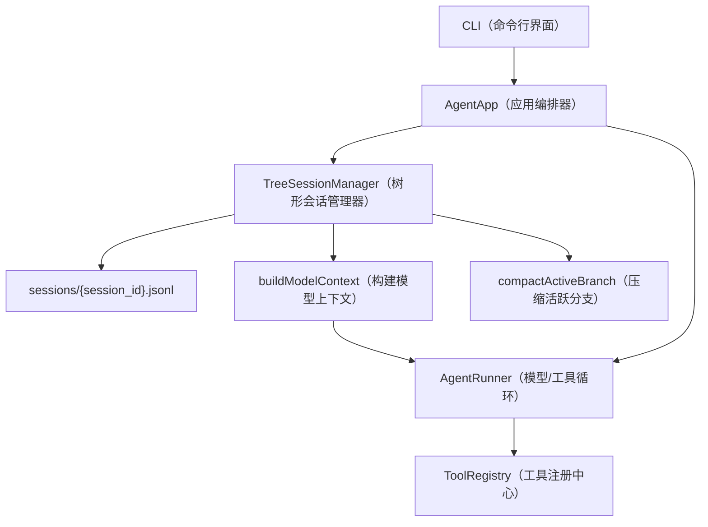

# Tree Session（树形会话）实现说明

## 1. 文档目的

本文说明当前 `my_agent2` 中 Tree Session（树形会话）的具体实现。它面向后续 context（上下文）和 memory（记忆）模块改造，重点回答三个问题：

- 当前会话树如何持久化、恢复和构建模型上下文。
- 分支、跳转、克隆、标签、压缩是如何落到代码里的。
- 后续 ContextFS（上下文文件系统）和 MemoryGraph（记忆图谱）应该如何接入，避免重复建设会话事实源。

说明：用户要求使用 codegraph MCP 查看代码；当前会话没有暴露可调用的 codegraph MCP 工具，`mcp_servers.json` 也只配置了 Tavily MCP。仓库中存在 `.codegraph/codegraph.db` 本地索引文件，但本次分析实际使用 `rg`、`git log` 和源码读取完成。

## 2. 最近更新概览

当前远端更新后，树形结构相关的最近提交主要是：

| Commit | 作用 | 影响 |
|---|---|---|
| `1a561ce` | 新增 Pi-compatible tree sessions | 引入 `tree_session.py`、CLI 树命令、runner 回调接入和测试。 |
| `315203c` | 默认关闭 legacy startup compaction（旧线性启动压缩） | 避免启动时自动压缩 `memory/history.jsonl`，让 `sessions/*.jsonl` 成为新的会话事实源。 |
| `7ac39e0` | 优化上下文压缩 | 增加结构化 summarization prompt（摘要提示词）、previous summary 更新、文件操作保留、安全压缩边界。 |
| `e094cd5` | 界面友好优化 | README/CLI 中文化，删除独立 Pi attribution 文档，把会话树说明并入主文档。 |

当前测试验证：

```powershell
$env:PYTHONPATH="src"; python -m unittest discover -s tests -v
```

结果：18 个测试通过。

## 3. 系统边界

### 3.1 负责什么

TreeSessionManager（树形会话管理器）负责：

- 以 append-only JSONL（只追加 JSON Lines）保存会话条目。
- 用 `parentId` 构建会话树。
- 用 `activeLeafId` 表示当前活跃分支的叶子节点。
- 从活跃分支生成模型调用所需 messages。
- 支持 `/tree`、`/jump`、`/fork`、`/clone`、`/label`。
- 支持 Context Ladder（上下文阶梯）和 branch/compaction summary（分支/压缩摘要）。

### 3.2 不负责什么

TreeSessionManager 不负责：

- 长期记忆治理。
- 结构化 memory object（记忆对象）的分类、检索和召回。
- ContextFS 的 URI（统一资源标识符）对象存储。
- 工具执行本身。
- 模型 provider（模型供应商）协议转换。

这些仍应分别由 MemoryStore（记忆存储入口）、未来的 ContextFS、RuntimeContextBuilder（运行时上下文构建器）、AgentRunner（智能体运行器）等模块负责。

## 4. 总体架构



核心设计是：`sessions/*.jsonl` 是会话事实源。程序启动后重放 JSONL 文件，恢复内存索引，再基于当前 `activeLeafId` 构建模型上下文。

## 5. 数据模型

### 5.1 SessionEntry（会话条目）

所有树节点都继承同一个基础结构：

```python
class SessionEntry:
    type: EntryType
    id: str
    sessionId: str
    parentId: str | None
    timestamp: str
    metadata: dict[str, Any]
```

关键字段：

- `id`：节点唯一标识。
- `parentId`：父节点 id；这是树结构的核心。
- `sessionId`：所属会话文件。
- `metadata.contextLayer`：上下文层级。

### 5.2 EntryType（条目类型）

当前支持的类型：

| 类型 | 中文说明 | 是否直接进入模型上下文 |
|---|---|---|
| `session_info` | 会话元信息 | 否 |
| `session_state` | active leaf 状态变更 | 否 |
| `message` | 用户或助手消息 | 是 |
| `tool_call` | 工具调用元数据 | 否 |
| `tool_result` | 工具结果 | 是 |
| `branch_summary` | 分支摘要 | 是 |
| `compaction` | 压缩摘要 | 是 |
| `label` | 标签 | 否 |
| `context_layer` | 上下文层级覆盖 | 否 |
| `raw` | 原始文件或日志引用 | 默认否 |
| `custom` | 自定义扩展条目 | 否 |

注意：`tool_call` 条目本身不进入模型上下文，但 assistant 的 `message.content` 中可能包含 `tool_use` block（工具调用块），所以模型仍能看到必要的工具调用上下文。

### 5.3 TreeSession（树形会话内存索引）

TreeSession 在内存中维护：

- `entries`：所有条目的追加顺序。
- `entriesById`：按 id 查条目。
- `childrenByParent`：按父节点查子节点。
- `labels`：节点标签。
- `activeLeafId`：当前活跃叶子节点。
- `rootId`：根节点。

这些索引都不是单独事实源，重启后通过 JSONL 重放恢复。

## 6. 写入流程

### 6.1 普通消息写入

`AgentApp.ask()` 先写用户消息：

```python
self.tree.append_message(self.session_id, {"role": "user", "content": user_input})
```

`append_message()` 默认把新消息挂到当前 `activeLeafId` 后面：

```python
parent_id = session.activeLeafId if parent_id is None else parent_id
```

底层统一调用 `append_entry()`：

1. 校验父节点存在。
2. 生成规范化 entry。
3. 追加写入 `sessions/{session_id}.jsonl`。
4. 更新内存索引。
5. 如果是树节点，追加一条 `session_state`，把 `activeLeafId` 移到新节点。

### 6.2 工具调用写入

runner 执行时通过回调写入：

- `on_assistant_message`：写 assistant message。
- `on_tool_call`：写 `tool_call`。
- `on_tool_result`：写 `tool_result`。

由于 runner 可能多轮调用工具，`history_provider=lambda: self.tree.buildModelContext(...)` 会在每轮模型调用前重新从树构建上下文，避免使用过期的线性列表。

## 7. 上下文构建

### 7.1 Active Branch（活跃分支）

`getBranch()` 从 `activeLeafId` 沿着 `parentId` 一路回溯到根节点，再反转成从根到叶的顺序：

```text
root -> ... -> activeLeafId
```

这意味着：

- JSONL 文件中所有历史分支都会保留。
- 只有 active branch 默认进入模型上下文。
- 兄弟分支不会污染当前 prompt。

### 7.2 _context_message_for_entry（条目转模型消息）

`_context_message_for_entry()` 是最终决定 entry 是否变成模型 message 的函数。

规则分两层：

1. 先按 ContextLayer（上下文层级）过滤。
2. 再按 entry 类型转换。

层级过滤：

- `L4_RAW_FILE_OR_LOG` 永远不直接进入模型上下文。
- 如果指定 `max_layer`，则层级大于 `max_layer` 的条目被排除。

类型转换：

| Entry 类型 | 转换结果 |
|---|---|
| `MessageEntry` | 原样返回 `entry.message` |
| `ToolResultEntry` | 转为 `{"role": "user", "content": [entry.toolResult]}` |
| `BranchSummaryEntry` | 转为 user 文本消息，内容为 branch summary |
| `CompactionEntry` | 转为 user 文本消息，内容为 compaction summary |
| 其他类型 | 返回 `None` |

### 7.3 Debug 输出

`debugBuildModelContext()` 返回：

- `activeLeafId`
- `activePathEntryIds`
- `includedEntryIds`
- `excludedEntryIds`
- `excludedReason`
- `siblingBranchEntryIds`
- `compactionApplied`
- `branchSummaryApplied`
- `estimatedTokens`
- `contextLayers`

这对后续 runtime context 可解释性很有用，建议保留并扩展。

## 8. 分支能力

### 8.1 jump

`jumpToEntry(session_id, entry_id)` 不新增业务节点，只追加 `session_state`，把 active leaf 指向目标节点。

语义：回到历史某一点继续。

### 8.2 fork

`forkFromEntry(session_id, entry_id)` 同样把 active leaf 指到目标节点。下一条用户输入会作为该节点的新 child，于是形成兄弟分支。

语义：从历史某一点开新分支。

### 8.3 clone

`cloneActiveBranch()` 把当前 active branch 复制到一个新 session 文件，并重新映射：

- entry id
- session id
- parent id
- branch summary 引用
- compaction 引用
- label 引用

语义：把当前分支变成独立会话，便于隔离探索。

### 8.4 label

`addLabel()` 追加 `label` 条目，不修改原节点。加载时 `_apply_entry()` 把标签写入内存 `labels` 映射。

## 9. Context Ladder（上下文阶梯）

当前层级：

| 层级 | 说明 | 默认类型 |
|---|---|---|
| `L0_METADATA` | 元数据 | `session_info`、`session_state`、`tool_call`、`label` |
| `L1_SUMMARY` | 摘要 | `branch_summary`、`compaction` |
| `L2_SELECTED_MESSAGES` | 普通消息 | `message` |
| `L3_TOOL_EVIDENCE` | 工具证据 | `tool_result` |
| `L4_RAW_FILE_OR_LOG` | 原始文件或日志 | `raw` |

`buildModelContext()` 不传 `max_layer`，默认排除 L4，其余按类型决定是否进入模型。  
`buildContextByLadder(session_id, maxLayer)` 可以显式限制最高层级，例如只取到 L2 时会排除 L3 tool evidence。

## 10. 压缩实现

### 10.1 压缩触发

CLI 的 `/compact` 调用：

```python
AgentApp.compact_now()
  -> _compact_active_branch()
  -> TreeSessionManager.compactActiveBranch()
```

普通自然语言不会触发压缩。legacy startup compaction 默认关闭，只有 `MY_AGENT_STARTUP_COMPACTION=true` 时才会处理旧 `memory/history.jsonl`。

### 10.2 压缩对象

压缩不会删除任何历史节点，而是在当前 active branch 末尾追加 `CompactionEntry`：

```python
class CompactionEntry:
    summary: str
    compactedEntryIds: list[str]
    firstKeptEntryId: str
    tokenEstimateBefore: int
    tokenEstimateAfter: int
```

字段含义：

- `summary`：旧上下文的结构化 checkpoint summary。
- `compactedEntryIds`：被摘要覆盖的旧节点 id。
- `firstKeptEntryId`：压缩后保留的最近原文窗口的第一个节点 id。
- `tokenEstimateBefore` / `tokenEstimateAfter`：压缩前后估算 token。

`firstKeptEntryId` 是摘要和原始近期消息的拼接点。后续构建上下文时，系统先注入 compaction summary，再从 `firstKeptEntryId` 开始接上未压缩的近期消息。

### 10.3 多次压缩

最新实现先调用 `_entries_after_latest_compaction()`，只在“最近一次压缩摘要 + 之后的新消息”上继续压缩。

如果再次压缩，它会把上一轮 `CompactionEntry.summary` 作为 `previous_summary` 传给 summarizer，使用 update prompt 更新摘要，而不是简单重复压缩全部历史。

这个设计避免：

- 多个旧 summary 重复进入上下文。
- 越压越长。
- 旧压缩摘要和新摘要互相打架。

### 10.4 结构化摘要提示词

最新版本新增了固定格式摘要：

- `SUMMARIZATION_SYSTEM_PROMPT`
- `SUMMARIZATION_PROMPT`
- `UPDATE_SUMMARIZATION_PROMPT`
- `TURN_PREFIX_SUMMARIZATION_PROMPT`
- `BRANCH_SUMMARY_PROMPT`

摘要结构包含：

- Goal
- Constraints & Preferences
- Progress
- Key Decisions
- Next Steps
- Critical Context

这比早期 `FakeSummarizer` 风格的普通摘要更适合作为可持续上下文。

### 10.5 文件操作保留

压缩摘要会自动追加：

```text
<read-files>
- path
</read-files>

<modified-files>
- path
</modified-files>
```

来源是 `tool_call` 或 assistant message 中的 `tool_use`：

- `read_file` 进入 read files。
- `write_file`、`edit_file` 进入 modified files。

这样即使具体工具结果被压缩掉，后续模型仍知道哪些文件被读过、改过。

### 10.6 安全压缩边界

最新实现补了一个重要边界：如果保留窗口的第一个节点是 `ToolResultEntry`，系统会向前扩展到对应的 assistant `tool_use` message。

原因是模型 API 要求 tool result 前面必须有对应 tool use。如果压缩后只保留 tool result，不保留 tool use，就会形成 orphan tool result（孤儿工具结果），导致后续模型消息非法或上下文难以理解。

相关逻辑：

- `_expand_kept_to_safe_boundary()`
- `_safe_compaction_boundary()`
- `_message_has_tool_use()`
- `_tool_result_use_id()`

测试 `test_compaction_does_not_keep_orphan_tool_result` 已覆盖该行为。

## 11. 分支摘要

`createBranchSummary(oldLeafId, targetId)` 用于从旧分支回到某个共同节点时，生成旧分支摘要并挂到目标节点下。

流程：

1. 找 old branch 和 target branch 的 common ancestor（共同祖先）。
2. 收集 old branch 中从 oldLeaf 到 common ancestor 之间的可上下文化条目。
3. 用 summarizer 生成 branch summary。
4. 自动追加文件操作块。
5. 追加 `BranchSummaryEntry` 到 target 节点下。
6. 把 active leaf 跳到这个 summary 节点。

这使得“回到主线时保留旁支结论”成为可能。

## 12. CLI 使用面

当前 CLI 暴露：

```text
/tree [--filter default|no-tools|user-only|labeled-only|all]
/jump ID
/fork ID
/clone
/label ID LABEL
/compact
```

`/tree` 支持过滤：

- `default`：隐藏 tool_call，显示主要会话结构。
- `no-tools`：隐藏 tool_call 和 tool_result。
- `user-only`：只显示用户消息。
- `labeled-only`：只显示有标签的节点。
- `all`：显示所有节点。

## 13. 与旧 memory/history 的关系

当前系统仍保留：

- `memory/history.jsonl`
- `memory/MEMORY.md`
- `memory/compactions.md`
- `templates/USER.md`

但树形会话的事实源已经是：

```text
sessions/{session_id}.jsonl
```

`memory/history.jsonl` 仍由 `MemoryStore.append_history()` 写入，更多是 legacy compatibility（旧兼容输出）。后续 context/memory 改造不应再以它作为主会话输入。

## 14. 对后续 Context/Memory 改造的建议

如果继续做比赛方案，建议明确采用：

```text
TreeSessionManager = raw session source of truth（原始会话事实源）
ContextFS = durable context/memory object store（持久上下文和记忆对象存储）
MemoryGraph = URI relation index（URI 关系索引）
RuntimeContextBuilder = per-turn recall renderer（每轮召回渲染器）
```

不要再新增并行的：

```text
memory/context/sessions/current/messages.jsonl
```

原因：

- TreeSession 已经完整保存 raw message、tool call、tool result、branch、compaction。
- 再维护一套 current messages 会造成一致性风险。
- 分支场景下，“当前会话”不是线性的，必须由 `activeLeafId` 决定。

更合理的接入点：

1. `compactActiveBranch()` 生成 `CompactionEntry` 后，触发 MemoryStore 的 session commit。
2. commit 使用 `compaction.summary`、`compactedEntryIds`、`firstKeptEntryId` 和 active branch 信息创建 ContextFS session archive。
3. RuntimeContextBuilder 每轮在 `AgentApp.ask()` 调用 runner 前注入召回上下文。
4. `debugBuildModelContext()` 的 included/excluded 原因可以扩展为 runtime context explainability（召回解释）。

## 15. 当前实现的风险和改进点

### 15.1 风险

- `tool_call` 条目不直接进入模型上下文，依赖 assistant message 中的 `tool_use` block 保留。正常 runner 流程没问题，但手工构造 session 时要注意。
- 多次压缩依赖 LLM 正确更新 previous summary；如果 summary 质量差，长期上下文会逐步失真。
- 文件操作块只识别 `read_file`、`write_file`、`edit_file` 的 `path` 参数，尚未覆盖 `grep`、`glob`、MCP 文件工具等。
- `ContextLayerEntry` 是追加式覆盖，当前没有复杂冲突处理；最后重放的层级变更生效。

### 15.2 建议

- 给 `CompactionEntry` 增加更结构化的 metadata，例如 `readFiles`、`modifiedFiles`，不要只放在文本块里。
- 为 `compactActiveBranch()` 返回的 compaction entry 增加 commit hook，给 ContextFS 提供统一入口。
- 把 `debugBuildModelContext()` 暴露为 CLI 调试命令，例如 `/tree-debug`。
- 为 branch summary 和 compaction summary 增加 schema 校验，降低 LLM 输出跑偏风险。
- 扩展文件操作采集，覆盖 `grep`、`glob`、MCP 工具和 shell 命令中的显式文件路径。

## 16. 结论

当前树形结构已经不是简单聊天历史，而是一个 append-only、可分支、可压缩、可解释的会话上下文层。

它的核心价值是：

- 原始历史不删除。
- 当前模型上下文只来自 active branch。
- 压缩以追加 summary 节点实现，不破坏历史。
- 支持安全保留工具调用边界。
- 为后续 ContextFS 和 MemoryGraph 提供稳定的 raw session 事实源。

因此，后续比赛方案应围绕 TreeSession 扩展，而不是绕过它重建一套线性 session capture。
