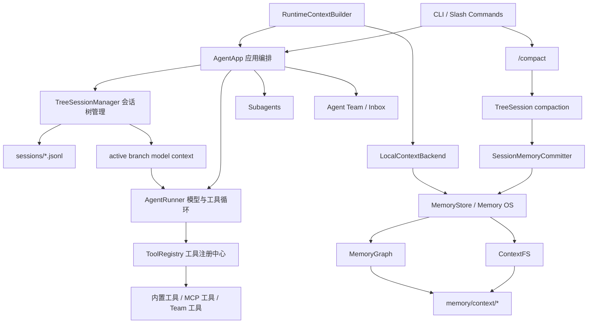

# ArborAgent 技术报告书

## 1. 项目概述

**ArborAgent** 是一个面向命令行工作流与复杂任务协作场景的本地通用 Agent 开发框架。项目围绕“可分支、可压缩、可追溯、可召回”的上下文与记忆能力展开，在基本 Agent loop、工具调用、MCP Server 接入、子 Agent 与 Agent Team 协作的基础上，构建了一套以树形会话和结构化长期记忆为核心的智能体运行架构。

项目的核心记忆模块命名为 **Arbor Memory Engine (AME)**，中文解释为“树形记忆引擎”。AME 将原始会话、长期记忆、记忆关系和运行时召回串联起来，使 Agent 不再只依赖线性聊天历史，而是能够在任务推进过程中保留多条探索路径、压缩历史上下文、沉淀可复用经验，并在后续模型调用前动态召回相关记忆。

一句话概括：

> ArborAgent 是一个以树形会话和结构化记忆为核心的本地通用 Agent 框架，旨在让智能体在长任务、多工具、多分支和多 Agent 协作场景中保持上下文清晰、记忆可审计、协作可持续。

## 2. 设计背景

随着大语言模型从单轮问答走向真实任务执行，Agent 系统需要处理越来越复杂的上下文问题。传统实现通常把对话历史按时间顺序线性追加，再把最近若干条消息交给模型。这种方式简单直接，但在复杂任务中会暴露出几个关键问题。

首先，**线性会话容易造成上下文污染**。用户在同一个任务中经常会探索不同方案，例如先让 Agent 尝试一种技术路线，随后回到历史节点尝试另一种路线。在线性历史中，旧方案、失败路径和新方案会混在一起，模型很难区分当前真正有效的上下文。

其次，**长上下文成本和稳定性问题会持续累积**。Agent 在运行过程中会产生工具调用、文件读取、搜索结果、代码片段和中间推理记录。如果全部保留在模型上下文中，token 成本会快速增长；如果简单裁剪，又容易丢失关键决策和任务状态。

第三，**长期记忆缺乏结构化管理**。许多 Agent 只把记忆写成普通文本笔记，缺少 URI 寻址、层级摘要、来源记录、关系链接和更新机制。这会导致记忆难以检查、难以复用，也难以在模型调用前准确召回。

第四，**工具系统、多 Agent 协作和记忆系统常常彼此割裂**。工具执行产生的信息没有被纳入统一的会话事实源，子 Agent 的报告难以沉淀成可检索经验，Agent Team 的协作状态也缺少长期上下文支撑。

ArborAgent 的设计目标正是解决这些问题：在不重写通用 Agent 执行底座的前提下，以会话树和结构化记忆作为差异化核心，让 Agent 具备更适合长任务和复杂协作的上下文管理能力。

## 3. 项目定位

ArborAgent 的定位不是单一聊天机器人，而是一个轻量化、可扩展的本地 Agent 框架。它面向的典型场景包括：

- 命令行中的研发、调研、分析、写作和自动化任务。
- 需要多轮工具调用的复杂工作流。
- 需要在历史节点之间跳转、分叉、回溯和复盘的探索式任务。
- 需要长期保存用户偏好、项目决策、任务约束和可复用经验的 Agent 应用。
- 需要子 Agent 或持久 Agent Team 协作的多角色任务。

在技术路线选择上，ArborAgent 采用本地文件系统作为主要持久化基础，强调可检查、可恢复和低依赖。系统支持 DeepSeek、Anthropic、OpenAI-compatible 等模型接口，支持本地内置工具与外部 MCP Server 工具接入，并通过统一的工具注册与执行循环把模型、工具、记忆和团队协作组织在一起。

项目的差异化重点集中在 **Arbor Memory Engine (AME)**。AME 不是单纯的“记住几条笔记”，而是将会话事实源、上下文压缩、长期记忆、记忆图谱和运行时召回设计成一条闭环：

```text
TreeSession 原始会话
  -> 当前 active branch 构建模型上下文
  -> /compact 生成结构化压缩条目
  -> SessionMemoryCommitter 提交会话归档
  -> ContextFS 写入长期记忆对象
  -> MemoryGraph 建立记忆关系
  -> RuntimeContextBuilder 每轮动态召回
  -> 注入下一轮 Agent 调用
```

## 4. 总体架构

ArborAgent 由 CLI 入口、应用编排层、模型执行层、工具系统、会话树、记忆系统和多 Agent 协作模块组成。整体架构如下：



其中，`AgentApp` 负责装配模型客户端、工具注册表、会话树、记忆系统、MCP 管理器、子 Agent 和团队协作模块。`AgentRunner` 负责执行模型调用和工具调用循环。`ToolRegistry` 统一管理内置工具、外部 MCP 工具、上下文工具和团队工具。`TreeSessionManager` 是原始会话事实源，`MemoryStore / Memory OS` 则承接长期记忆的结构化存储与召回。

## 5. 核心功能设计

### 5.1 基本 Agent Loop

ArborAgent 具备完整的 Agent loop。用户输入进入系统后，应用层会先写入会话树，再构建当前分支上下文并调用模型。模型可以直接回复，也可以发起工具调用。工具执行结果会作为后续上下文继续交给模型，直到模型完成本轮任务。

执行流程可以概括为：

```text
用户输入
  -> 写入 TreeSession
  -> 构建 runtime context
  -> 构建 system prompt
  -> AgentRunner 调用模型
  -> 模型选择回复或调用工具
  -> 工具结果回写会话树
  -> 模型继续推理并输出最终结果
```

该循环支持流式输出、token 记录、工具调用回调、工具结果回写和历史上下文重建。与传统线性历史不同，ArborAgent 的模型上下文来自当前 active branch，而不是简单取最后若干条消息。

### 5.2 斜杠命令

ArborAgent 提供面向命令行使用的斜杠命令，用于直接控制 Agent 运行状态和上下文结构。典型命令包括：

| 命令 | 功能 |
|---|---|
| `/help` | 查看命令帮助 |
| `/tools` | 查看当前已注册工具 |
| `/todos` | 查看任务列表 |
| `/memory` | 查看结构化长期记忆 |
| `/context` | 查看 ContextObject 列表 |
| `/mcp` | 查看 MCP Server 状态和远端工具 |
| `/compact` | 压缩当前 active branch 并提交记忆 |
| `/tree` | 查看当前 JSONL 会话树 |
| `/jump ID` | 跳转到历史节点 |
| `/fork ID` | 从历史节点创建新探索分支 |
| `/clone` | 克隆当前 active branch 到新 session |
| `/label ID LABEL` | 给会话树节点打标签 |
| `/team` | 查看持久队友状态 |
| `/inbox` | 读取 lead inbox |

这些命令使用户可以显式地管理 Agent 的任务状态、记忆状态和会话结构，而不是把所有控制意图都混入自然语言对话。

### 5.3 工具系统与 MCP Server 接入

ArborAgent 的工具系统以 `ToolRegistry` 为中心。所有工具都提供名称、描述、参数 schema 和执行逻辑，模型通过统一格式调用工具，Runner 再负责执行并回传结果。

内置工具覆盖常见本地工作流：

- 文件读取、写入、编辑。
- glob 文件发现与 grep 搜索。
- shell 命令执行。
- 网页抓取。
- todo 任务状态维护。
- skill 加载。
- 长期记忆写入。
- 上下文搜索、读取、列表与链接查看。
- 子 Agent 派遣。
- Agent Team 消息通信。

在外部工具扩展方面，ArborAgent 支持接入 MCP Server。系统可以从 `mcp_servers.json` 读取配置，支持 stdio 与 Streamable HTTP 两类传输方式，并将远端工具注册为本地可调用工具。工具命名采用 `mcp_{server}_{tool}` 形式，避免与内置工具冲突。

MCP 接入让 ArborAgent 可以复用外部生态中的工具能力，而不用为每一种外部服务单独编写专用适配器。

### 5.4 子 Agent

ArborAgent 支持一次性子 Agent 派遣。主 Agent 可以通过 `dispatch_subagent` 将独立任务交给特定角色的子 Agent，例如 researcher、analyst、coder、reviewer。子 Agent 拥有独立历史和受控工具白名单，完成任务后返回简明报告。

子 Agent 的设计重点是任务隔离：主 Agent 不必把所有探索过程都塞入自身上下文，而是可以把局部调研、代码审查、分析或实现任务交给专门角色完成。独立的子 Agent 调用可以并行执行，从而提升复杂任务处理效率。

### 5.5 Agent Team

除一次性子 Agent 外，ArborAgent 还支持持久 Agent Team。用户可以创建命名队友，系统会保存队友配置、运行状态和 inbox 消息。队友 Agent 能够接收任务、处理消息、向 lead 汇报结果，并在空闲时等待新的 inbox 输入。

Agent Team 提供了更接近真实协作的机制：

- 每个队友有稳定名称和角色。
- 队友状态可持久保存。
- lead 与队友之间通过文件背书的 inbox 通信。
- 支持点对点消息和广播。
- 队友可被重新唤起并继续承担任务。

这使 ArborAgent 不仅能完成单 Agent 工具调用，也能组织多角色、多线程的任务协作。

## 6. Arbor Memory Engine (AME)

**Arbor Memory Engine (AME)** 是 ArborAgent 的核心创新模块。它把 TreeSession、ContextFS、MemoryGraph、RuntimeContextBuilder 和 SessionMemoryCommitter 组合成完整的上下文与记忆闭环。

AME 的目标不是简单保存对话记录，而是让 Agent 具备以下能力：

- 原始会话可恢复、可审计。
- 多条探索路径互不污染。
- 长上下文可以安全压缩。
- 长期记忆可以结构化存储与检索。
- 记忆之间可以建立关系。
- 每轮模型调用前可以动态召回相关上下文。

### 6.1 TreeSession：树形会话事实源

`TreeSession` 是 ArborAgent 的原始会话事实源。系统将会话条目以 append-only JSONL 形式持久化，每个条目都包含 `id`、`parentId`、`sessionId`、`timestamp` 等基础字段。`parentId` 是树结构的关键：每条消息、工具调用或压缩摘要都指向父节点，整个会话因此不再是线性数组，而是一棵可回溯的会话树。

TreeSession 支持的主要条目类型包括：

| 类型 | 说明 |
|---|---|
| `SessionInfoEntry` | 会话元信息 |
| `SessionStateEntry` | 当前 active leaf 状态 |
| `MessageEntry` | 用户或 assistant 消息 |
| `ToolCallEntry` | 工具调用 |
| `ToolResultEntry` | 工具结果 |
| `BranchSummaryEntry` | 分支摘要 |
| `CompactionEntry` | 上下文压缩摘要 |
| `LabelEntry` | 节点标签 |
| `ContextLayerEntry` | 上下文层级控制 |

系统启动或恢复时会 replay JSONL 文件，重建内存索引、父子关系、标签、active leaf 和压缩条目。这样设计的好处是：历史不被覆盖，状态可恢复，运行过程可审计。

### 6.2 Active Branch 上下文隔离

传统 Agent 往往从线性历史中截取最近消息作为模型上下文。ArborAgent 则从当前 `activeLeafId` 开始，沿 `parentId` 一路回溯到根节点，只收集当前 active branch 上的条目。

这带来几个重要特性：

- 当前分支的上下文完整保留。
- 兄弟分支不会进入模型上下文。
- JSONL 文件写入顺序不会影响模型看到的历史。
- 用户可以跳转到任意历史节点，再从该节点继续形成新分支。

因此，Agent 可以在同一个任务中安全探索不同方案。例如，用户可以先尝试方案 A，再回到共同祖先节点尝试方案 B。两个方案共享必要前置上下文，但不会互相污染。

### 6.3 Tree Compaction：树形会话压缩

随着任务推进，active branch 也会不断增长。ArborAgent 通过 `/compact` 命令显式触发上下文压缩。压缩过程会在当前 active branch 上追加 `CompactionEntry`，将较旧上下文压缩成结构化 checkpoint summary，同时保留最近消息原文。

压缩后的模型上下文形态是：

```text
compaction summary + recent kept messages
```

原始历史不会被删除，只是在后续构建模型上下文时由压缩摘要替代旧条目。系统还会处理工具调用边界，避免出现“只有工具结果、没有对应工具调用来源”的孤立上下文。

这种方式兼顾了长期任务所需的历史连续性和模型上下文成本控制。

### 6.4 SessionMemoryCommitter：压缩边界记忆提交

`SessionMemoryCommitter` 是 TreeSession 与长期记忆系统之间的边界提交器。它消费 `CompactionEntry`，读取压缩摘要、被压缩条目、首个保留条目、token 估算和 active branch debug 信息，然后生成 session archive，并触发结构化记忆抽取。

这一设计明确了长期记忆写入边界：自动长期记忆不从任意中间对话随意写入，而是在 `/compact` 形成稳定摘要后提交。这样可以减少噪声进入长期记忆，也让每条记忆都有明确来源。

### 6.5 ContextFS：URI 化三层记忆对象

`ContextFS` 是 ArborAgent 的持久上下文对象存储。它将长期记忆保存为可寻址的 `ContextObject`，每个对象具有 URI、类型、标题、摘要、概览、正文路径、来源、可信度、敏感级别、状态、标签和元数据。

ContextFS 采用 L0/L1/L2 三层内容模型：

| 层级 | 含义 | 用途 |
|---|---|---|
| L0 | 一句话摘要 | 快速检索与列表展示 |
| L1 | 可注入概览 | 运行时上下文召回 |
| L2 | 完整正文 | 深度读取与审计 |

典型 URI 包括：

```text
mem://user/preferences/{slug}
mem://user/events/{yyyy}/{mm}/{dd}/{slug}
mem://project/decisions/{slug}
mem://project/constraints/{slug}
mem://agent/cases/{slug}
ctx://sessions/archives/{yyyy}/{mm}/{dd}/{session_id}-{compaction_id}
```

URI 化设计使长期记忆不再只是散落文本，而是可以被搜索、读取、列举、链接和审计的结构化对象。

### 6.6 MemoryGraph：轻量记忆图谱

`MemoryGraph` 保存 ContextFS URI 之间的关系链接。它不存储正文内容，也不取代 ContextFS 的事实源地位，而是作为轻量派生索引存在。

支持的关系包括：

- `supports`：支持。
- `contradicts`：矛盾。
- `updates`：更新。
- `related`：相关。
- `derived_from`：派生自。
- `uses_tool`：使用工具。

当新记忆写入时，系统可以通过 LLM 或关键词降级策略自动建立相关链接。记忆图谱使 Agent 不仅能检索单条记忆，还能沿关系找到相关经验、旧决策、更新记录或来源会话。

### 6.7 RuntimeContextBuilder：运行时可解释召回

`RuntimeContextBuilder` 在每轮模型调用前根据用户当前输入搜索 ContextFS，并通过 MemoryGraph 做有限扩展，最终生成可注入 system prompt 的 Markdown 上下文块。

召回结果包含 URI、可信度、更新时间、匹配原因和摘要，具备可解释性。系统还通过数量和字符预算控制召回规模，并默认过滤敏感、隔离或过期记忆。

这种机制让 Agent 可以在每轮任务中动态获得相关长期记忆，而不是把所有记忆一次性塞入 prompt。

## 7. 技术创新点

### 7.1 从线性历史到树形会话事实源

ArborAgent 将原始会话建模为 append-only JSONL 会话树，而不是线性消息数组。通过 `parentId` 和 `activeLeafId`，系统能够表达跳转、分叉、克隆和标签等操作。模型上下文只来自当前 active branch，从结构上解决了多路径探索中的上下文污染问题。

### 7.2 将压缩作为记忆提交边界

许多 Agent 的记忆写入发生在任意对话时刻，容易把临时信息、错误中间状态或噪声写入长期记忆。ArborAgent 将自动记忆提交绑定到 TreeSession compaction：先形成稳定的结构化摘要，再由 `SessionMemoryCommitter` 写入长期记忆。这让长期记忆具有更清晰的来源、边界和可信度。

### 7.3 URI 化三层记忆模型

ArborAgent 使用 ContextFS 把长期记忆保存为 URI 对象，并区分 L0 摘要、L1 概览和 L2 正文。相比普通文本记忆，这种结构更适合检索、注入、审计和后续扩展，也方便模型在不同场景中读取不同粒度的信息。

### 7.4 轻量记忆图谱而非重型图数据库

MemoryGraph 采用本地 JSONL 链接索引保存记忆之间的关系，不引入图数据库。它保留了图谱式召回的核心价值，同时保持系统轻量、可检查、易迁移。这种设计适合比赛和本地 Agent 框架场景，能够以较低工程复杂度获得关系化记忆能力。

### 7.5 运行时可解释召回

ArborAgent 的运行时记忆召回不是黑箱注入。每条召回内容都包含 URI、可信度、更新时间和摘要，模型和用户都可以追溯其来源。召回内容通过预算裁剪进入 system prompt，既支持长期记忆复用，又避免无节制扩展上下文。

### 7.6 工具、会话和记忆统一闭环

工具调用、模型回复、压缩摘要和长期记忆都围绕 TreeSession 与 Memory OS 形成闭环。工具结果进入会话树，压缩摘要进入会话归档，归档再生成长期记忆，长期记忆又在后续任务中被召回。这种闭环让 Agent 的“执行过程”和“经验沉淀”不再割裂。

### 7.7 子 Agent 与持久团队协作

ArborAgent 同时支持一次性子 Agent 和持久 Agent Team。前者适合隔离执行局部任务，后者适合多角色持续协作。结合 AME 的长期记忆能力，系统可以把多 Agent 协作产生的知识和决策沉淀到统一记忆层中，为后续任务复用。

## 8. 功能模块清单

| 模块 | 核心能力 | 价值 |
|---|---|---|
| Agent Loop | 模型调用、工具调用、流式输出、历史回写 | 支撑通用 Agent 执行 |
| Slash Commands | `/tools`、`/memory`、`/compact`、`/tree` 等 | 提供显式控制界面 |
| Tool System | 文件、shell、网页、todo、remember、context tools | 扩展 Agent 行动能力 |
| MCP Bridge | stdio / Streamable HTTP 外部工具接入 | 复用 MCP 工具生态 |
| Subagents | researcher、analyst、coder、reviewer 等角色 | 隔离并行处理子任务 |
| Agent Team | 命名队友、状态持久化、inbox、广播 | 支持持续多 Agent 协作 |
| TreeSession | JSONL 会话树、跳转、分叉、克隆、标签 | 消除线性历史污染 |
| Tree Compaction | active branch 压缩、保留近期上下文 | 控制长上下文成本 |
| ContextFS | URI、L0/L1/L2、metadata、diff | 管理结构化长期记忆 |
| MemoryGraph | 记忆关系链接与扩展 | 支持图谱式召回 |
| RuntimeContextBuilder | 每轮检索并注入相关记忆 | 让长期记忆参与当前任务 |
| SessionMemoryCommitter | compaction 到 memory 的提交桥梁 | 建立稳定记忆写入边界 |

## 9. 典型运行流程

以一次复杂研发任务为例，ArborAgent 的运行方式如下：

1. 用户在 CLI 中提出任务。
2. `AgentApp` 将用户消息写入 TreeSession。
3. `RuntimeContextBuilder` 根据输入召回相关长期记忆。
4. `ContextBuilder` 构建包含工作区、记忆、用户画像、技能和 runtime context 的 system prompt。
5. `AgentRunner` 调用模型。
6. 模型根据需要调用文件工具、shell 工具、MCP 工具或子 Agent。
7. 工具调用和结果写回 TreeSession。
8. 用户可通过 `/tree` 查看会话树，通过 `/jump` 或 `/fork` 切换探索路径。
9. 当上下文增长后，用户通过 `/compact` 压缩当前 active branch。
10. `SessionMemoryCommitter` 将压缩摘要提交为 session archive，并抽取长期记忆。
11. 新记忆写入 ContextFS，关系写入 MemoryGraph。
12. 后续对话中，相关记忆会被 RuntimeContextBuilder 召回并注入模型上下文。

这个流程体现了 ArborAgent 的核心思想：Agent 的每一次执行不仅是一次即时响应，也是在持续构建可复用、可回溯、可解释的任务记忆。

## 10. 应用价值

ArborAgent 的设计适合需要长期上下文和复杂执行链路的 Agent 应用。相比只具备基础工具调用的 Agent，它在以下方面具有明显价值：

- **更适合探索式任务**：会话树支持从历史节点重新分叉，避免不同方案互相干扰。
- **更适合长任务**：压缩机制降低上下文成本，同时保留历史摘要。
- **更适合知识沉淀**：ContextFS 将经验保存为结构化对象，而不是散乱文本。
- **更适合协作场景**：子 Agent 和 Agent Team 支持多角色并行处理。
- **更适合评估和复盘**：JSONL 会话树、ContextObject 和 diff 日志都可检查。
- **更适合扩展生态**：MCP Bridge 让外部工具可以接入同一 Agent loop。

## 11. 后续演进方向

ArborAgent 的架构为后续扩展保留了清晰边界。未来可以从以下方向继续增强：

- 扩展 MCP resources 与 prompts 映射，让外部上下文资源也进入统一记忆体系。
- 引入更强的检索排序能力，提高大规模长期记忆下的召回精度。
- 增强 MemoryGraph 的冲突检测、更新链追踪和可视化能力。
- 为 Agent Team 增加更细粒度的任务分配、状态监控和协作复盘机制。
- 提供 Web UI 或 TUI，让会话树、记忆对象和图谱关系更直观可操作。
- 增加更多领域技能模板，使框架更容易适配研发、调研、写作、数据分析等垂直场景。

## 12. 总结

ArborAgent 以树形会话和结构化记忆为核心，重新组织了 Agent 的上下文生命周期。它将原始会话保存在可恢复的 TreeSession 中，通过 active branch 隔离不同探索路径，通过 `/compact` 建立安全的上下文压缩和记忆提交边界，再通过 ContextFS、MemoryGraph 和 RuntimeContextBuilder 实现长期记忆的持久化、关系化和运行时召回。

这种设计使 ArborAgent 不只是一个能调用工具的命令行 Agent，而是一个面向长任务、多分支、多工具和多 Agent 协作的通用智能体框架。项目的核心贡献在于：把“Agent 如何执行任务”和“Agent 如何保存、组织、复用任务经验”统一到同一套可审计、可扩展的上下文与记忆架构中。
